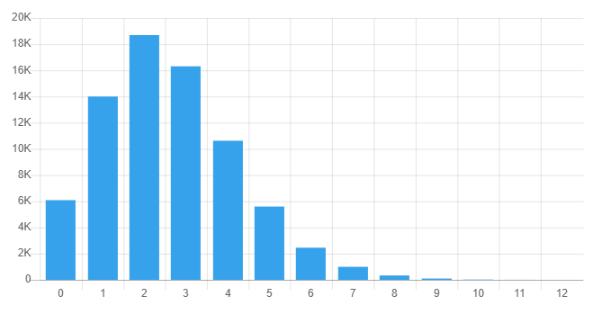
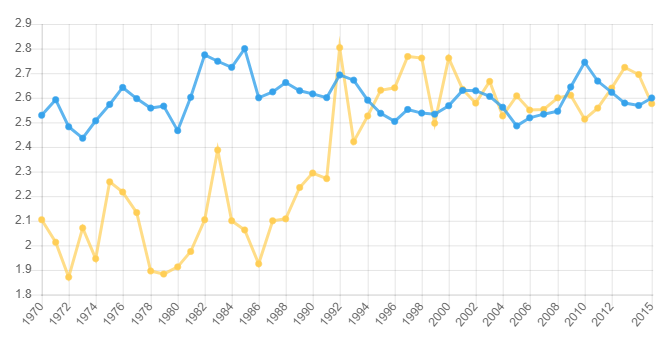
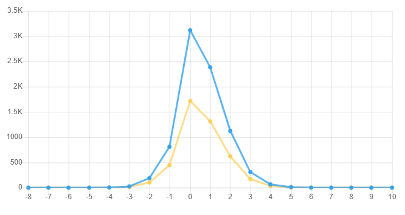

# Pizza_post.sql

#### Q1

- σ(age<18)(Persons)

```SQL
SELECT * 
FROM Persons 
WHERE age < 18;
```

#### Q2

- π(pizzeria_name, pizza, price)(σ(pizza=pizza_name ∧ name='Amy' ∧ price<10.00)(Eats ⨝ Pizza))

```SQL
SELECT Pizzerias.pizzeria_name, Pizza.pizza_name, Eats.price
FROM Eats 
JOIN Pizza ON Eats.pizza = Pizza.pizza_name 
JOIN Pizzerias ON Eats.pizzeria = Pizzerias.pizzeria_name 
WHERE Eats.price < 10.00 AND Eats.name = 'Amy';
```

#### Q3

- π(pizzeria_name, name, age)(σ(age<18)(Persons) ⨝ Eats ⨝ σ(pizzeria_name=pizzeria)(Pizzerias))

```SQL
SELECT DISTINCT Pizzerias.pizzeria_name, Persons.name, Persons.age 
FROM Persons 
JOIN Eats ON Persons.name = Eats.name 
JOIN Pizzerias ON Eats.pizzeria = Pizzerias.pizzeria_name 
WHERE Persons.age < 18;
```

#### Q4

- π(pizzeria_name)(σ(age<18)(Persons) ⨝ Eats ⨝ σ(age>30)(Persons) ⨝ σ(pizzeria_name=pizzeria)(Pizzerias))

```SQl
SELECT DISTINCT Pizzerias.pizzeria_name 
FROM Persons 
JOIN Eats ON Persons.name = Eats.name 
JOIN Pizzerias ON Eats.pizzeria = Pizzerias.pizzeria_name 
WHERE Persons.age < 18 
INTERSECT SELECT DISTINCT Pizzerias.pizzeria_name 
FROM Persons 
JOIN Eats ON Persons.name = Eats.name 
JOIN Pizzerias ON Eats.pizzeria = Pizzerias.pizzeria_name 
WHERE Persons.age > 30;
```

#### Q5

- π(pizzeria_name, P1.name, P1.age, P2.name, P2.age)( (σ(age<18)(P1) ⨝ Eats ⨝ σ(pizzeria_name=pizzeria)(Pizzerias)) ⨝ (σ(age>30)(P2) ⨝ Eats ⨝ σ(pizzeria_name=pizzeria)(Pizzerias)) )

```SQL
SELECT DISTINCT Pizzerias.pizzeria_name, P1.name, P1.age, P2.name, P2.age 
FROM Persons AS P1 
JOIN Eats ON P1.name = Eats.name 
JOIN Pizzerias ON Eats.pizzeria = Pizzerias.pizzeria_name 
JOIN Persons AS P2 ON Eats.name = P2.name 
WHERE P1.age < 18 AND P2.age > 30 AND P1.name <> P2.name;
```

#### Q6

- π(name, count(pizza))(σ(count(pizza) > 1)(Eats))

```SQL
SELECT name, COUNT(DISTINCT pizza) as num_pizzas 
FROM Eats GROUP BY name HAVING num_pizzas > 1 
ORDER BY num_pizzas DESC;
```

#### Q7

- π(pizza, AVG(price))(Eats ⨝ Pizza)

```SQl
 SELECT Pizza.pizza_name, AVG(Eats.price) as avg_price 
 FROM Eats 
 JOIN Pizza ON Eats.pizza = Pizza.pizza_name 
 GROUP BY Pizza.pizza_name 
 ORDER BY avg_price DESC;
```

# Soccer_Post.sql


#### Q1

> Find all the games in England between seasons 1920 and 1999 such that the total goals are at least 13.
> Order by total goals descending.

```SQL
SELECT date, season, home, visitor, hgoal, vgoal, tier, totgoal, goaldif, result
FROM england
WHERE season >= 1920 AND season <= 1999 AND totgoal >= 13
ORDER BY totgoal DESC;
```

#### Q2

> For each total goal result, find how many games had that result.
> Use the England table and consider only the seasons since 1980.
> Order by total goal.

```SQL
SELECT totgoal, COUNT(*) as num_games
FROM england
WHERE season >= 1980
GROUP BY totgoal
ORDER BY totgoal;
```



#### Q3

> Find for each team in England in tier 1 the total number of games played since 1980.
> Report only teams with at least 300 games.
>
> Hint. Find the number of games each team has played as "home".
> Find the number of games each team has played as "visitor".
> Then union the two and take the sum of the number of games.

```sql
SELECT team, SUM(num_games) AS total_games
FROM
(
    SELECT home AS team, COUNT(*) AS num_games
    FROM england
    WHERE tier = 1 AND season >= 1980
    GROUP BY home
    UNION ALL
    SELECT visitor AS team, COUNT(*) AS num_games
    FROM england
    WHERE tier = 1 AND season >= 1980
    GROUP BY visitor
) AS all_games
GROUP BY team
ORDER BY total_games DESC;
```

#### Q4

> For each pair team1, team2 in England, in tier 1,
> find the number of home-wins since 1980 of team1 versus team2.
> Order the results by the number of home-wins in descending order.
>
> Hint. After selecting the tuples needed (... WHERE tier=1 AND ...) do a GROUP BY home, visitor.

```Sql
SELECT home AS team1, visitor AS team2, COUNT(*) AS home_wins
FROM england
WHERE tier = 1 AND season >= 1980 AND result = 'H'
GROUP BY home, visitor
ORDER BY home_wins DESC;
```


#### Q5

> For each pair team1, team2 in England in tier 1
> find the number of away-wins since 1980 of team1 versus team2.
> Order the results by the number of away-wins in descending order.

```sql
SELECT home, visitor, COUNT(*) AS away_wins
FROM england
WHERE tier = 1 AND season >= 1980 AND result = 'A'
GROUP BY home, visitor
ORDER BY away_wins DESC;
```


#### Q6

> For each pair team1, team2 in England in tier 1 report the number of home-wins and away-wins
> since 1980 of team1 versus team2.
> Order the results by the number of away-wins in descending order.
>
> Hint. Join the results of the two previous queries. To do that you can use those
> queries as subqueries. Remove their ORDER BY clause when making them subqueries.
> Be careful on the join conditions.

```sql
SELECT hw.home AS team1, hw.visitor AS team2, hw.home_wins, aw.away_wins
FROM
(SELECT home, visitor, COUNT(*) AS home_wins
FROM england
WHERE tier=1 AND season >= 1980 AND result='H'
GROUP BY home, visitor) AS hw
JOIN
(SELECT home, visitor, COUNT(*) AS away_wins
FROM england
WHERE tier=1 AND season >= 1980 AND result='A'
GROUP BY home, visitor) AS aw
ON hw.home=aw.visitor AND hw.visitor=aw.home
ORDER BY aw.away_wins DESC;

CREATE VIEW Wins AS
SELECT hw.home AS team1, hw.visitor AS team2, hw.hwins AS home_wins, aw.awins AS away_wins
FROM
(SELECT home, visitor, COUNT(*) AS hwins
FROM england
WHERE tier=1 AND season >= 1980 AND result='H'
GROUP BY home, visitor) AS hw
JOIN
(SELECT home, visitor, COUNT(*) AS awins
FROM england
WHERE tier=1 AND season >= 1980 AND result='A'
GROUP BY home, visitor) AS aw
ON hw.home = aw.visitor AND hw.visitor = aw.home
ORDER BY aw.awins DESC;

SELECT * FROM Wins;
```


#### Q7

```sql

```


#### Q8

> Winning at home is easier than winning as visitor.
> Nevertheless, some teams have won more games as a visitor than when at home.
> Find the team in Germany that has more away-wins than home-wins in total.
> Print the team name, number of home-wins, and number of away-wins.

```sql
SELECT home AS team, SUM(hgoal) AS home_wins, SUM(vgoal) AS away_wins
FROM germany
WHERE tier = 1 AND season >= 1980
GROUP BY team
HAVING SUM(hgoal) < SUM(vgoal)
ORDER BY away_wins DESC;
```


#### Q9

> One of the beliefs many people have about Italian soccer teams is that they play much more defense than offense.
> Catenaccio or The Chain is a tactical system in football with a strong emphasis on defence.
> In Italian, catenaccio means "door-bolt", which implies a highly organised and effective backline defence
> focused on nullifying opponents' attacks and preventing goal-scoring opportunities.
> In this question we would like to see whether the number of goals in Italy is on average smaller than in England.
>
> Find the average total goals per season in England and Italy since the 1970 season.
> The results should be (season, england_avg, italy_avg) triples, ordered by season.
>
> Hint.
> Subquery 1: Find the average total goals per season in England.
> Subquery 2: Find the average total goals per season in Italy
>    (there is no totgoal in table Italy. Take hgoal+vgoal).
> Join the two subqueries on season.

```sql
SELECT england.season, england.avg_goals AS england_avg, italy.avg_goals AS italy_avg
FROM
(SELECT season, AVG(totgoal) AS avg_goals
FROM england
WHERE season >= 1970
GROUP BY season) AS england
JOIN
(SELECT season, AVG(hgoal+vgoal) AS avg_goals
FROM italy
WHERE season >= 1970
GROUP BY season) AS italy
ON england.season = italy.season
ORDER BY england.season;
```



> I observed that Italy got better as the seasons Progressed and that England was relatively constant

#### Q10

> Find the number of games in France and England in tier 1 for each goal difference.
> Return (goaldif, france_games, eng_games) triples, ordered by the goal difference.
> Normalize the number of games returned dividing by the total number of games for the country in tier 1,
> e.g. 1.0*COUNT(*)/(select count(*) from france where tier=1)

```sql
SELECT diff.goaldif AS goaldif,
  1.0 * COUNT( f.result='D' ) / (SELECT COUNT(*) FROM france WHERE tier=1) AS france_games,
  1.0 * COUNT(e.result='D') / (SELECT COUNT(*) FROM england WHERE tier=1) AS eng_games
FROM
  (SELECT hgoal - vgoal AS goaldif
   FROM france
   WHERE tier=1
   UNION
   SELECT hgoal - vgoal AS goaldif
   FROM england
   WHERE tier=1 ) AS diff
JOIN france AS f ON f.tier=1  AND f.hgoal-f.vgoal = diff.goaldif
JOIN england AS e ON e.tier=1  AND e.hgoal-e.vgoal = diff.goaldif
GROUP BY diff.goaldif
ORDER BY diff.goaldif ASC;
```



#### Q11

> Find all the seasons when England had higher average total goals than France.
> Consider only tier 1 for both countries.
> Return (season,england_avg,france_avg) triples.
> Order by season.

```sql
SELECT england.season, AVG(england.totgoal) AS england_avg, AVG(france.totgoal) AS france_avg
FROM england
JOIN france ON england.season = france.season
WHERE england.tier = 1 AND france.tier = 1
GROUP BY england.season
HAVING AVG(england.totgoal) > AVG(france.totgoal)
ORDER BY england.season
```

