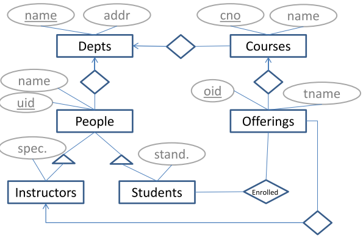

# <u>Final Review</u>

[TOC]

## Study Topics (Table of Contents):

### ER, Tables, Queries, Constraints

- [ER Diagrams](#er-diagrams)
- [Classes](#classes)
- [Mutually exclusive subclasses](#mutually-exclusive-subclasses)
- [Table Creation](#table-creation)
- [Views](#views)
- [SQL](#sql)
- [Correlated Subqueries](#correlated-subqueries)

### External Storage

- [Disks](#disks)
- [Disk Access Time](#disk-access-time)
- [MIN time to read a 16,384-byte block](#min-time-to-read-a-16,384-byte-block)
- [MAX time to read a 16,384-byte block](#max-time-to-read-a-16,384-byte-block)
- [AVG time to read a 16,384-byte block](#avg-time-to-read-a-16,384-byte-block)

### Indexes

#### BTrees

- [Lookup](#lookup)
- [Insertion](#insertion)
- [Structure of B-trees with real blocks](#structure-of-b-trees-with-real-blocks)

#### 2PMMS

- [How many records can we sort?](#how-many-records-can-we-sort)
- [Sorting larger files](#sorting-larger-files)

### Query Evaluation

- [An SQL query and its RA equivalent](#an-sql-query-and-its-ra-equivalent)
- [Running Example – Airline](#running-example--airline)
- [Cost of a Plan (Pushing selections)](#cost-of-a-plan-pushing-selections)

### Concurrency

- [Summarizing the Terminology](#summarizing-the-terminology)
- [Precedence graphs](#precedence-graphs)
- [Two Phase Locking](#two-phase-locking)
- [Shared/Exclusive Locks](#sharedexclusive-locks)
- [Upgrading Locks](#upgrading-locks)
- [Possibility for Deadlocks](#possibility-for-deadlocks)
- [Benefits of Update Locks](#benefits-of-update-locks)

### Recovery from Crashes

#### UNDO

- [Undo with NQ Checkpointing](#undo-with-nq-checkpointing)

#### REDO

- [Redo with Checkpointing](#redo-with-checkpointing)

#### UNDO/REDO

- [Undo/Redo with Checkpointing](#undo/redo-with-checkpointing)
- [UNDO vs REDO vs UNDO/REDO](#undo-vs-redo-vs-undo/redo)

### Database Normalization (BCNF)

- [Births Table](#births-table)
- [Anomalies](#anomalies)
- [Functional Dependencies](#functional-dependencies)
- [Keys of Relations](#keys-of-relations)
- [Boyce-Codd Normal Form](#boyce-codd-normal-form)

#### Decomposition into BCNF

- [Babies Example](#babies-example)

#### Rules About Functional Dependencies

- [Movie Example](#movie-example)

# // Content

## ER, Tables, Queries, Constraints

#### ER Diagrams

##### Overview




#### Table Creation

```SQL
CREATE TABLE Students (
  uid CHAR(10) PRIMARY KEY REFERENCES People(uid),
  standing VARCHAR(30)
);

CREATE TABLE Courses (
  cno CHAR(8) PRIMARY KEY,
  name VARCHAR(40),
  dname VARCHAR(20) REFERENCES Depts(name)
);

CREATE TABLE Offerings (
  oid INT PRIMARY KEY,
  cno CHAR(8) REFERENCES Courses(cno),
  tname CHAR(6),
  uid CHAR(10) REFERENCES Instructors(uid)
);
CREATE TABLE Depts (
  name VARCHAR(20) PRIMARY KEY,
  addr VARCHAR(20)
);

CREATE TABLE People (
  uid CHAR(10) PRIMARY KEY,
  name VARCHAR(20),
  dname VARCHAR(20) REFERENCES Depts(name)
);

CREATE TABLE Instructors (
  uid CHAR(10) PRIMARY KEY REFERENCES People(uid),
  specialty VARCHAR(40)
);
```

##### Inserting Into Tables

```SQL
INSERT INTO Depts VALUES('Comp.Sci.', 'ECS Bldg');
INSERT INTO People VALUES('V111111111', 'Jon', 'Comp.Sci.');
INSERT INTO People VALUES('V222222222', 'Ben', 'Comp.Sci.');
INSERT INTO Instructors VALUES('V111111111', 'Hardware');
INSERT INTO Students VALUES('V222222222', '3rd year');
INSERT INTO Courses VALUES('CSC390', 'Hardware Systems', 'Comp.Sci.');
INSERT INTO Offerings VALUES(1, 'CSC390', '201409', 'V111111111');
INSERT INTO Enrolled VALUES(1, 'V222222222');
```

#### mutually exclusive subclasses

```SQL
CREATE TABLE Vehicles (
  vin CHAR(17) PRIMARY KEY,
  vehicle_type CHAR(3) CHECK(vehicle_type IN ('SUV', 'ATV')),
  fuel_type CHAR(4),
  door_count INT CHECK(door_count >= 0),
  UNIQUE(vin, vehicle_type)
);

CREATE TABLE SUVs (
  vin CHAR(17) PRIMARY KEY,
  vehicle_type CHAR(3) CHECK(vehicle_type = 'SUV'),
  FOREIGN KEY (vin, vehicle_type) REFERENCES Vehicles (vin, vehicle_type)
);

CREATE TABLE ATVs (
  vin CHAR(17) PRIMARY KEY,
  vehicle_type CHAR(3) CHECK(vehicle_type = 'ATV'),
  FOREIGN KEY (vin, vehicle_type) REFERENCES Vehicles (vin, vehicle_type)
);

```

In the context of object-oriented programming and database design, mutually exclusive subclasses refer to a type of class hierarchy in which each subclass represents a specific subset of the superclass, and the subsets do not overlap. In other words, an object can only belong to one subclass at a time.

This type of subclass hierarchy can be useful for modeling entities in a database where there are clear distinctions between different types of objects, and objects cannot belong to multiple categories simultaneously. It can also help to enforce data integrity by preventing objects from being classified in conflicting ways.

##### Subtypes and keys

> **Primary Keys**
>
> A primary key is a column or combination of columns in a table that uniquely identifies each row in the table. A primary key constraint ensures that the values in the primary key column(s) are unique and not null. Primary keys are used as foreign keys in other tables to establish relationships between tables.

> **Foreign Keys**
>
> A foreign key is a column or combination of columns in a table that refers to the primary key of another table. A foreign key constraint ensures that the values in the foreign key column(s) match the values in the primary key column(s) of the referenced table or are null. Foreign keys are used to establish relationships between tables and enforce referential integrity.

> **Unique Keys**
>
> A unique key is a constraint that ensures that the values in a column or combination of columns are unique across all rows in a table. Unlike a primary key, a unique key does not have to be a candidate for a primary key, but it can be used as a foreign key to establish relationships between tables.

> **Check Keys**
>
> A check constraint is a constraint that specifies a condition that must be true for each row in a table. Check constraints can be used to enforce business rules or data integrity constraints that cannot be enforced by primary keys, foreign keys, or unique keys. For example, a check constraint can ensure that the values in a column fall within a specific range or meet a certain condition.

#### Views 

a view is a virtual table that is based on the result of a query. Views are not physical tables, but they behave like tables and can be queried like tables. Views are useful for simplifying complex queries, enforcing data security by controlling user access to certain data, and providing a way to customize data presentation.

Example:

```SQL
CREATE VIEW employee_info AS
SELECT name, department
FROM employees;
```

```SQL
SELECT * FROM employee_info;
```

This query would return a table with two columns: "name" and "department". The data in the table would be the same as the data in the "employees" table, but with the "id" column removed.

##### WITH CHECK OPTION

The WITH CHECK OPTION is a feature in SQL that is used to enforce a constraint on a view. It is used to ensure that any data modification (insert, update or delete) made through the view satisfies the same conditions as the view definition.

```SQL
CREATE VIEW high_salary_employees AS
SELECT id, name, salary
FROM employees
WHERE salary > 50000
WITH CHECK OPTION;
```

```SQL
INSERT INTO high_salary_employees (id, name, salary)
VALUES (4, 'Jane Doe', 40000);

-- ERROR: new row violates check option for view "high_salary_employees"

```

#### SQL

**Sample Table Data**

Consider the following tables for the examples:

**employees**:

| employee_id | first_name | last_name | department_id | salary |
| ----------- | ---------- | --------- | ------------- | ------ |
| 1           | John       | Doe       | 1             | 5000   |
| 2           | Jane       | Smith     | 1             | 5500   |
| 3           | Jim        | Brown     | 2             | 6000   |
| 4           | Jake       | White     | 2             | 6500   |

**departments**:

| department_id | department_name |
| ------------- | --------------- |
| 1             | HR              |
| 2             | IT              |

##### SELECT … FROM … WHERE … GROUP BY … HAVING … ORDER BY

This clause is used to query data from one or multiple tables, filter rows based on specific conditions, group the results, and order them.

```SQL
SELECT department_id, COUNT(employee_id) as num_employees, AVG(salary) as avg_salary
FROM employees
WHERE salary >= 5000
GROUP BY department_id
HAVING COUNT(employee_id) > 1
ORDER BY department_id ASC;
```

*Output:*

| department_id | num_employees | avg_salary |
| ------------- | ------------- | ---------- |
| 1             | 2             | 5250       |
| 2             | 2             | 6250       |

##### JOIN ON, JOIN USING, LEFT JOIN, RIGHT JOIN

These clauses are used to combine rows from two or more tables based on a related column.

###### JOIN ON

```SQL
SELECT e.employee_id, e.first_name, e.last_name, d.department_name
FROM employees e
JOIN departments d ON e.department_id = d.department_id;
```

*Output:*

| employee_id | first_name | last_name | department_name |
| ----------- | ---------- | --------- | --------------- |
| 1           | John       | Doe       | HR              |
| 2           | Jane       | Smith     | HR              |
| 3           | Jim        | Brown     | IT              |
| 4           | Jake       | White     | IT              |

###### JOIN USING

```SQL
SELECT e.employee_id, e.first_name, e.last_name, d.department_name
FROM employees e
JOIN departments d USING (department_id);
```

*Output:*

| employee_id | first_name | last_name | department_name |
| ----------- | ---------- | --------- | --------------- |
| 1           | John       | Doe       | HR              |
| 2           | Jane       | Smith     | HR              |
| 3           | Jim        | Brown     | IT              |
| 4           | Jake       | White     | IT              |

###### LEFT JOIN

```SQl
SELECT e.employee_id, e.first_name, e.last_name, d.department_name
FROM employees e
LEFT JOIN departments d ON e.department_id = d.department_id;
```

*Output:*

| employee_id | first_name | last_name | department_name |
| ----------- | ---------- | --------- | --------------- |
| 1           | John       | Doe       | HR              |
| 2           | Jane       | Smith     | HR              |
| 3           | Jim        | Brown     | IT              |
| 4           | Jake       | White     | IT              |

###### RIGHT JOIN

```sql
SELECT e.employee_id, e.first_name, e.last_name, d.department_name
FROM employees e
RIGHT JOIN departments d ON e.department_id = d.department_id;
```

*Output:*

| employee_id | first_name | last_name | department_name |
| ----------- | ---------- | --------- | --------------- |
| 1           | John       | Doe       | HR              |
| 2           | Jane       | Smith     | HR              |
| 3           | Jim        | Brown     | IT              |
| 4           | Jake       | White     | IT              |

###### LIKE

LIKE is used with the WHERE clause to search for a specified pattern in a column.

```SQl
SELECT * FROM employees WHERE first_name LIKE 'J%';
```

*Output:*

| employee_id | first_name | last_name | department_id | salary |
| ----------- | ---------- | --------- | ------------- | ------ |
| 1           | John       | Doe       | 1             | 5000   |
| 2           | Jane       | Smith     | 1             | 5500   |
| 3           | Jim        | Brown     | 2             | 6000   |
| 4           | Jake       | White     | 2             | 6500   |

###### IS NULL, IS NOT NULL

IS NULL is used to filter rows with NULL values, while IS NOT NULL filters rows without NULL values.

```SQl
SELECT * FROM employees WHERE department_id IS NOT NULL;
```

*Output:*

| employee_id | first_name | last_name | department_id | salary |
| ----------- | ---------- | --------- | ------------- | ------ |
| 1           | John       | Doe       | 1             | 5000   |
| 2           | Jane       | Smith     | 1             | 5500   |
| 3           | Jim        | Brown     | 2             | 6000   |
| 4           | Jake       | White     | 2             | 6500   |

##### Careful what can go to SELECT when having GROUP BY

When using GROUP BY, the SELECT statement should only contain columns that are part of the GROUP BY clause or columns that are part of an aggregate function like COUNT(), SUM(), AVG(), MIN(), or MAX().

```SQL
SELECT department_id, first_name, COUNT(employee_id) as num_employees
FROM employees
GROUP BY department_id;
```

This query would result in an error, as `first_name` is not part of the GROUP BY clause or an aggregate function.

##### Difference between HAVING and WHERE

- The WHERE clause is used to filter rows before they are grouped and aggregated. It works on the individual rows of the table.
- The HAVING clause is used to filter the results after they have been grouped and aggregated. It works on the grouped rows created by the GROUP BY clause.

```SQL
SELECT department_id, COUNT(employee_id) as num_employees, AVG(salary) as avg_salary
FROM employees
WHERE salary >= 5000
GROUP BY department_id
HAVING COUNT(employee_id) > 1;
```

In this example, the WHERE clause filters employees with a salary of 5000 or more, and then the HAVING clause filters groups with more than one employee.

#### Correlated Subqueries

A  **correlated subquery** is a subquery that depends on values from the outer query. It is used to filter data based on a condition that involves a table from the outer query.

The subquery is evaluated for each row of the outer query, which makes it slower than a regular subquery. However, it allows for more complex filtering of data.

A common use case for correlated subqueries is to find the maximum or minimum value of a column for each group in the outer query.

> Example:
>
> **StarsIn(movie, movie, starName, salary)**
>
> Now, find the stars who were paid for some movie more than the average salary for that movie.
>
> ```SQL
> SELECT starName, title, year
> FROM StarsIn X
> WHERE salary > (
>   SELECT AVG(salary)
>   FROM StarsIn
>   WHERE title = X.title AND year=X.year
> );
> ```
>
> Note: Semantically, the value of the X tuple changes in the outer query, so the database must rerun the subquery for each X tuple.

##### Another Solution (Nesting in FROM)

```SQl
SELECT X.starName, X.title, X.year
FROM StarsIn X, (
  SELECT title, year, AVG(salary) AS avgSalary
  FROM StarsIn
  GROUP BY title, year
) Y
WHERE X.salary > Y.avgSalary AND X.title = Y.title AND X.year = Y.year;
```

> Note: Nesting subqueries in the **`WHERE` clause is used to filter the rows returned by the outer query**, while nesting subqueries in the **`FROM` clause is used to create a temporary table or view that is used in the outer query.**

#### PARTITION BY

is a clause used in SQL to divide a result set into partitions or groups based on a specified column or expression. This clause is typically used with aggregate functions like `SUM`, `AVG`, and `COUNT` to calculate results on each partition separately.

Example:

| year | month | sales |
| ---- | ----- | ----- |
| 2020 | 1     | 100   |
| 2020 | 2     | 200   |
| 2020 | 3     | 150   |
| 2021 | 1     | 250   |
| 2021 | 2     | 300   |
| 2021 | 3     | 200   |

Suppose we want to calculate the total sales for each year and month combination. We can use the `PARTITION BY` clause with the `SUM` function as follows:

```SQl
SELECT year, month, sales, SUM(sales) OVER (PARTITION BY year, month) AS total_sales
FROM sales;
```

In this query, the `PARTITION BY` clause is used to divide the result set into partitions based on the `year` and `month` columns. The `SUM` function is then used with the `OVER` clause to calculate the total sales for each partition separately.

| year | month | sales | total_sales |
| ---- | ----- | ----- | ----------- |
| 2020 | 1     | 100   | 100         |
| 2020 | 2     | 200   | 200         |
| 2020 | 3     | 150   | 150         |
| 2021 | 1     | 250   | 250         |
| 2021 | 2     | 300   | 300         |
| 2021 | 3     | 200   | 200         |

As you can see, the `SUM` function calculates the total sales for each year and month combination separately using the `PARTITION BY` clause.

## External Storage

#### Disks


#### Disk Access Time

- **Seek time** = time to move heads to proper cylinder (track).
- **Rotational delay** = time for desired block to come under head.
- **Transfer time** = time during which the block passes under head.

#### *MIN* time to read a 16,384-byte block

- **The minimum time, is just the transfer time.** 
- Heads must pass over 4 sectors and the 3 gaps between them.
- Gaps represent 10% of the circle and sectors the remaining 90%,
  - *36 degrees are occupied by gaps* and
  - *324 degrees by the sectors.*
  - 256 gaps and 256 sectors around the circle,
- So
  - a gap is 36/256 = 0.14 degrees, and
  - a sector is 324/256 = 1.265 degrees
- Total degrees covered by 3 gaps and 4 sectors is:
  - 3*0.14+4*1.265 = 5.48 degrees
- Transfer time: (5.48/360) x 8.33 = **0.13 ms**

> Summery:
>
> Gaps: **10%** -> **36** Degrees -> **256** of them -> **36/256** = **0.14** degrees
>
> Sectors: **90%** -> **324** Degrees -> **256** of them -> **324/256** = **1.265** degrees
>
> TOTAL DEGREES TRAVELED:
>
> (3 * 0.14) + (4 * 1.265) * 8.33 = 0.13
>
> NOTE: 8.33ms = time for a full rotation of disk

#### *MAX* time to read a 16,384-byte block

To calculate the worst-case scenario for reading a 16,384-byte block, we need to consider the factors that affect the time taken to read data from a storage device, such as disk latency and transfer rates. The worst-case scenario usually occurs when the storage device has to perform a maximum number of seeks and rotations to access the desired data.

1. **Worst-case seek time**: 17.38 ms This is the time it takes for the read/write head to move to the desired track in the worst-case scenario. Time to travel 65,536 cylinders at 4000 cycles/ms plus 1ms for start-stop
2. **Worst-case rotational latency**: 8.33 ms This is the time it takes for the desired sector to rotate under the read/write head in the worst-case scenario. Time for a full rotation. There are 7200 rotations per min. So, 1/7200 is the time in min for one rotation. 60*1000/7200 = 8.33ms is time in ms for one rotation.
3. **Transfer time**: 0.13 ms This is the time it takes to read the 16 KB block at the given transfer rate.

<u>**Total worst-case latency:**</u>

= Worst-case seek time + Worst-case rotational latency + Transfer time

= 17.38 ms + 8.33 ms + 0.13 ms

= 25.84 ms

#### *AVG* time to read a 16,384-byte block


## Indexes

### BTrees

#### Lookup

#### Insertion

#### Structure of B-trees with real blocks

### 2PMMS

#### How many records can we sort?

#### Sorting larger files

## Query Evaluation

#### An SQL query and its RA equivalent

#### Running Example – Airline

#### Cost of a Plan (Pushing selections)

## Concurrency

#### Summarizing the Terminology

#### Precedence graphs

#### Two Phase Locking

#### Shared/Exclusive Locks

#### Upgrading Locks

#### Possibility for Deadlocks

#### Benefits of Update Locks

## Recovery from Crashes

### UNDO

#### Undo with NQ Checkpointing

### REDO

#### Redo with Checkpointing

### UNDO/REDO

#### Undo/Redo with Checkpointing

#### UNDO vs REDO vs UNDO/REDO

## Database Normalization (BCNF)

#### Births Table

#### Anomalies

#### Functional Dependencies

#### Keys of Relations

#### Boyce-Codd Normal Form

### Decomposition into BCNF

#### Babies Example

### Rules About Functional Dependencies

#### Movie Example