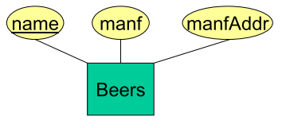

# (CSC 370) Database Systems - Complete Notes - Spring 2023
[TOC]

# Class Intro

>  Alex Thomo (thomo@uvic.ca)
>
> Office Hours:
>
> - Tuesday 9:00am-10:00am (https://uvic.zoom.us/j/81584166127)
> - Friday 9:00am-10:00am (https://uvic.zoom.us/j/81584166127)

## Content

This course is an introduction to database systems. Topics include database design, query languages, query optimization, concurrency control, and recovery from failures.

- Database design
- Relational Algebra
- SQL
- Data Analytics
- Security
- Query evaluation
- Transaction Management
- Recovery from System Failures

## Textbooks

**Database Systems: The Complete Book** - by Hector Garcia-Molina, Jeffrey D. Ullman, and Jennifer D. Widom Prentice Hall, 2nd Edition, ISBN: 0131873253

## Assignments

## Course Evaluation

- Assignments (20%) - (4 x 5%) 
- Midterm (25%)
- Final exam (55%)

## Lecture Slides

[Lecture 0](assets/L0.pdf) - Entity-Relationship Model

[Lecture 1](assets/L1.pdf) - From E/R Diagrams to Relations

[Lecture 2](assets/L2.pdf) - SQL


# Entity-Relationship Model

## Database design 

- designing a database:
  - what **information** the database must hold
  - what **relationships** are there among components of that information.
- Notation for expressing designs: **<u>Entity-Relationship (E/R) model</u>**


## Elements of the Entity-Relationship Model

| Name          | Shape/Color      | Example                                                      |
| ------------- | ---------------- | ------------------------------------------------------------ |
| Entity Sets   | Square / Green   |  |
| Attributes    | Circle / White   |  |
| Relationships | Diamond / Yellow |  |

#### Example


## Visualizing Binary Entity-Relationship Relationships

- They are just sets of pairs:

| Movies         | Stars                 |
| -------------- | --------------------- |
| Basic Instinct | Sharon Stone          |
| Total recall   | Arnold Schwarzenegger |
| Total recall   | Sharon Stone          |

## Multiplicity of Relationships

#### Many-To-One


#### One-To-One


#### Many-To-Many


**Note:** Sometimes binary relationships aren’t enough!

Ex. 


>  Q: What could go wrong with this design? 
>
> A: Problem with finding which stars a studio is paying for a given movie.

## Why some studio-movie-star triples can be invalid?

Example:

**Carolco Pictures** paid **Arnold Schwarzenegger** for **Total Recall TriStar** paid **Sharon Ston**e for **Total Recall**.

- Using “Owns” and “Stars-In” we will have the following triples: (CP, TR, AS) <u>(CP, TR, SS)</u> <u>(TS, TR, AS)</u> (TS, TR, SS)

- The <u>second</u> and the <u>third</u> triples aren’t valid.
- If we consider the collection of all the valid triples, it is nothing else but a **three way relationship** between **Studios, Movies** and **Stars**

Solution: (Three way relationship)


## Attributes on Relationships


## Roles in a Relationship

- An entity set can appear two or more times in a relationship. 
- Each line to the entity set represents a different role.


- A movie may have **many sequels**, but for each sequel there is **only one original movie.**


## "Bars-Beer-Drinkers" Example

- Bars sell some beers.
- Drinkers like some beers.
- Drinkers frequent some bars.
- What would the E/R diagram be?


#### "Bar-Beers-Drinkers" Multiway Relationship

Suppose that drinkers will only drink certain beers at certain bars.


## A Typical Relationship Set

| Bar       | Drinker | Beer       |
| --------- | ------- | ---------- |
| Joe's Bar | Ann     | Miller     |
| Sue's Bar | Ann     | Bud        |
| Sue's Bar | Ann     | Pete's ale |
| Joe's Bar | Bob     | Bud        |
| Joe's Bar | Bob     | Miller     |
| Joe's Bar | Cal     | Miller     |
| Sue's Bar | Cal     | Bud Lite   |

## Multiple Relationships Between Two Entity Sets


## “Exactly one” Multiplicity


- Some beers are not the best-seller of any manufacturer, so a rounded arrow to Manfs would be inappropriate.
- But a manufacturer has to have a best-seller.

## Exercise 1

- Let us design a database for a bank, including information about customers and their accounts. Information about a customer includes their name, address, phone, and SIN number. Accounts have numbers, types (e.g., savings, checking) and balances. We also need to record the customer(s) who own an account. Draw the E/R diagram for this database.
- Modify your solution as follows: 
  - a) Change your diagram so an account can have only one customer. 
  - b) Change your diagram so that a customer can have a set of addresses (which are street-city-province triples) and a set of phones. Remember that we do not allow attributes to have nonatomic types, such as sets, in the E/R model.
  - c) Further modify your diagram so that customers can have a set of addresses, and at each address there is a set of phones.

## Exercise 2

- Give an E/R diagram for a database recording information about teams, players, and their fans, including: 

  1. For each team, its name, its players, its team captain (one of its players), and the colors of its uniform.

  2. For each player, his/her name. 
  3. For each fan, his/her name, favorite teams, favorite players, and favorite color.

- Suppose we wish to add to the schema a relationship “Led-by” among two players and a team. The intention is that this relationship set consists of triples
  (player1, player2, team) such that player 1 played on the team at a time when some other player 2 was the team captain. 

- Draw the modification to the E/R diagram.

## Keys

- A key (for an entity set) is a set of attributes such that no two entities are the same on all the attributes of the key.
- In Entity-Relationship, we underline the key attribute(s).


## Keys for Movies

- Let’s consider the entity set **Movie**.
- We might assume that the attribute title is a key. However, there can be different movies with the same name:
  - “Godzilla” has several different versions (Japanese, American etc.).
- If we **enforce** in the database a **key constraint** on attribute **title** of **Movie** class, then the DBMS will not allow us to insert information about different “Godzilla’s”.
- A better choice is to take the set {title, year} of attributes as a key.
  - We still run the risk that there are two movies made in the same year, with the same title, but that’s very unlikely.

## Keys for Studios and Stars

- For **Studios**:
  - Reasonable to assume that there are no two studios having the **same name**.
  - So, we will enforce **name** to serve as a **key**.
- For **Stars**:
  - We may think that the name can’t serve to distinguish two people, but…
  - Yes! For stars the name distinguishes them since traditionally they choose “stage names”.
  - So, again here, we will enforce **name** to serve as a **key.**

## Surrogate Keys

- Often, people introduce attributes whose role is to serve as a key for classes. 
  - Companies assign employee ID’s to all employees, and these ID’s are carefully chosen to be unique numbers.
  - In Canada everyone has a SIN. 
  - Students ID’s in universities
  - Driver’s license numbers
  - Automobile registration numbers

## Entity Sets Versus Attributes I

> Example: (Bad Design)
>
> 
>
> 1. Repeats the manufacturer’s address once for each beer; 
> 2. Loses the address if there are temporarily no beers for a manufacturer.

## Entity Sets Versus Attributes II

- An entity set should satisfy at least one of the following conditions:
  - It is more than the name of something; it has at least one nonkey attribute.
  - It is the “many” in a many-one or many-many relationship.

> Example: (Good Design)
>
> 
>
> - Manfs deserves to be an entity set because of the nonkey attribute addr.
> - Beers deserves to be an entity set because it is the “many” of the many-one relationship ManfBy.

## Subclasses

- Sometimes, a class (entity set) contains certain objects (entities) that have special properties not associated with all members of the class.


## Inheritance in the Entity-Relationship Model

- E/R entities have components in all subclasses to which they belong.

> Example: 
>
> Roger Rabit, which is both a <u>cartoon</u> and <u>murder-mystery</u>
>
> - will have components in all three entity sets: **Movies**, **Cartoons**, **Murder-Mysteries**.
> - i.e. it will have all four attributes of **Movies**, the attribute **weapon**, and finally will participate in the relationship **voices**.
>
> 

## Keys for entity set Hierarchies

- **Key of root is key for all.**
  - Ex. **{title,year}** is the key for **Movies**, **Cartoons** and **Murder-Mysteries**.


## Weak Entity Sets

- Occasionally, entities of an entity set need “help” to identify them uniquely.
- Entity set E is said to be weak if:
  - in order to identify entities of E uniquely, we need to follow one or more many-one relationships from E and include the key of the related entities from the connected entity sets.

> Example: Weak Entity Sets
>
> - **name** is almost a key for **football players**, but there might be two with the same name.
> - **number** is certainly not a key, since players on two teams could have the same number.
> - But **number**, together with the team **name** related to the player by **Plays-on** should be unique.

## In Entity-Relationship Diagrams


- Double diamond for **supporting** many-one relationship.
- Double rectangle for the weak entity set.

## Weak Entity-Set Rules

- A weak entity set has one or more many-one relationships to other
  (supporting) entity sets.
  - Not every many-one relationship from a weak entity set need be supporting.
  - But supporting relationships must have a rounded arrow (entity at the “one” end is guaranteed).
- The key for a weak entity set is its own underlined attributes and the keys for the supporting entity sets.
  - E.g., (player) **number** and (team) **name** is a key for **Players** in the previous example.

# From Entity-Relationship Diagrams to Relations


## Relations (or Tables) Terminology


## Terminology

Every attribute has an atomic type.

- **Relation Schema:** relation name + attribute names + attribute types
- **Relation instance:** a set of tuples. Only one copy of any tuple! 
- **Database Schema:** a set of relation schemas. 
- **Database instance**: a relation instance for every relation in the schema.

## From Entity-Relationship Diagrams to Relations

- **Entity sets** become relations with the same set of attributes.
- **Many-Many Relationships** become relations whose attributes are only:
  -  The keys of the connected entity sets.
  - Attributes of the relationship itself.
  - Sometimes attribute renaming needed to avoid name clashes.
- **Many-One Relationships** usually don’t need separate tables.
  - The key of the “one” side is included in the relation of the “many” side
- **One-One Relationships** are similar.
- **Ternary (or higher) relationships** need separate tables with keys of the participating entity sets. 
  - The key is the union of keys of the “many” sides.

#### Example 1: Entity Sets to Relations


#### Example 2: With Attribute Renaming


#### Example 3


#### Example 4


## Handling Weak Entity Sets

- Relation for a weak entity set must include attributes for its complete key (including those belonging to other entity sets), as well as its own, nonkey attributes.
- A supporting (double-diamond) relationship is redundant and yields no relation.

#### Example 1


#### Example 2


#### Example 3


#### Example 4


#### Example 5 ("Isa")


## The 00 Approach

- Every subclass has its own relation.
  - All the properties of that subclass, including all its inherited properties, are represented in this relation.

> Example:
>
> Movies( title, year, length, filmType ) 
>
> Cartoons( title, year, length, filmType ) 
>
> MurderMysteries( title, year, length, filmType, weapon) 
>
> Cartoon-MurderMysteries( title, year, length, filmType, weapon) 
>
> Voices( title, year, starName )

- Can we merge Cartoons with Movies?
  - If we do, we lose information about which moves are cartoons.

## Entity-Relationship Approach

- We will have the following relations:
  - Movies(title, year, length, filmType).
  - MurderMystery(title, year, weapon).
  - Cartoons(title, year).
  - Voices(title, year, name).

## Entity-Relationship approach - Remarks

- No relation for class Cartoon-MurderMystery.
- For a movie that is both, we obtain:
  - its voices from the Voices relation
  - its weapon from the MurderMystery relation
  - and all other information from the Movies relation.
- Relation Cartoons has a schema that is a subset of the schema for the relation Voices. *Should we eliminate the relation Cartoons?*
- However there may be **silent** cartoons in our database. Those cartoons would have no voices and we would lose them.

## Comparison of Approaches

#### OO translation drawback:

- Too many tables! Why?
  - In the OO approach if we have a root and n children we need 2^n different tables!!!

#### E/R translation drawback: 

 We may have to look in several relations to gather information about a single object.

- For example, if we want the length and weapon used for a murder mystery film, we have to look at Movies and MurderMysteries relations.

#### OO translation advantage: 

- The OO translation keeps all properties of an object together in one relation.

#### E/R translation advantage: 

- The E/R translation allows us to find in one relation tuples from all classes in the hierarchy.

##### Comparison Examples

- <u>What movies of 2009 were longer than 150 minutes?</u>
  - Can be answered directly in the E/R approach.
  - In the OO approach we have to examine all the relations.
- <u>What weapons were used in cartoons of over 150 minutes in length?</u>
  - More difficult in the E/R approach. 
    - We should access Movies to find those of over 150 mins.
    - Then, we have to access Cartoons to see if they are cartoons.
    - Then we should access MurderMysteries to find the weapon.
  - In OO approach we need only access the Cartoon-MyrderMysteries table.

## Null Values to Combine Relations

- If we are **allowed** to use **NULL** in tuples, we can handle a hierarchy of classes with a single relation.
  - This relation has attributes for all the properties possessed by objects in any of the classes of the hierarchy.
  - An object is represented by a single tuple. This tuple has NULL in each attribute corresponding to a property that does not belong to the object’s class.
- If we apply this approach to the Movie hierarchy, we would create a single relation whose schema is:
  - **Movie**(title, year, length, filmType, studioName, starName, voice, weapon) 
    - “Who Framed Roger Rabbit?”, being both a cartoon and a murder-mystery, would be represented by several tuples that had no NULL’s.
    - The Little Mermaid, being a cartoon but not a murder-mystery, would have NULL in the weapon component.
- This approach allows us to find **all** the information about an object in one relation. Drawback?
  - Depending on the data, there could be too many nulls.

# SQL 

## Create Table

```sql
CREATE TABLE Studios( name VARCHAR(20), website VARCHAR(255));

CREATE TABLE Stars ( name VARCHAR(20), gender CHAR(1), birthyear INT, birthplace VARCHAR(40));

CREATE TABLE Movies ( title VARCHAR(50), year INT, length INT, rating CHAR(2), studioname VARCHAR(20));

CREATE TABLE StarsIn ( title VARCHAR(50), year INT, starname VARCHAR(20));
```

## CHAR and VARCHAR

- **CHAR(n)** allocates a fixed space, and if the string that we store is shorter than **n**, then it is padded with blanks.
- Differently, **VARCHAR(n)** denotes a string of up to **n** characters.
  - VARCHAR(n) allows for compression to save space.
- Use CHAR(n) for frequently used fields, and use VARCHAR(n) otherwise.

## Insert - Studios

```sql
INSERT INTO Studios 
VALUES('Fox', 'foxmovies.com');

INSERT INTO Studios 
VALUES('Disney', 'disney.com');

INSERT INTO Studios 
VALUES('Paramount', 'www.paramount.com');
```

## Insert - Movies

```sql
INSERT INTO Movies 
VALUES('Walk the Line', 2005, 136, 'PG', 'Fox');

INSERT INTO Movies 
VALUES('Pretty Woman', 1990, 119, 'R', 'Disney');

INSERT INTO Movies 
VALUES('Wayne''s World', 1991, 104, 'PG', 'Paramount');

INSERT INTO Movies 
VALUES('Unfaithful', 2002, 124, 'R', 'Fox');

INSERT INTO Movies 
VALUES('Runaway Bride', 1999, 116, 'PG', 'Paramount');

INSERT INTO Movies 
VALUES('The Princess and the Frog', 2009, 97, 'G', 'Disney');
```

## Insert - Stars

```sql
INSERT INTO Stars 
VALUES('Richard Gere', 'M', 1949, 'Philadelphia, Pennsylvania, USA');

INSERT INTO Stars 
VALUES('Joaquin Phoenix', 'M', 1974, 'San Juan, Puerto Rico');

INSERT INTO Stars 
VALUES('Reese Witherspoon', 'F', 1976, 'Baton Rouge, Louisiana, USA');

INSERT INTO Stars 
VALUES('Julia Roberts', 'F', 1967, 'Smyrna, Georgia, USA');

INSERT INTO Stars 
VALUES('Mike Myers', 'M', 1963, 'Scarborough, Ontario, Canada');

INSERT INTO Stars 
VALUES('Oprah Winfrey', 'F', 1954, 'Kosciusko, Mississippi, USA');
```

## Insert - StarsIn

```sql
INSERT INTO StarsIn 
VALUES('Walk the Line', 2005, 'Joaquin Phoenix'); 

INSERT INTO StarsIn 
VALUES('Walk the Line', 2005, 'Reese Witherspoon');

INSERT INTO StarsIn 
VALUES('Pretty Woman', 1990, 'Richard Gere'); 

INSERT INTO StarsIn 
VALUES('Pretty Woman', 1990, 'Julia Roberts');

INSERT INTO StarsIn 
VALUES('Wayne''s World', 1991, 'Mike Myers');

INSERT INTO StarsIn 
VALUES('Unfaithful', 2002, 'Richard Gere');

INSERT INTO StarsIn 
VALUES('Runaway Bride', 1999, 'Richard Gere');

INSERT INTO StarsIn 
VALUES('Runaway Bride', 1999, 'Julia Roberts'); 

INSERT INTO StarsIn 
VALUES('The Princess and the Frog', 2009, 'Oprah Winfrey');
```

## Create Table with Primary Keys

```sql
CREATE TABLE Studios(
    name VARCHAR(20) PRIMARY KEY, 
    website VARCHAR(255)
);

CREATE TABLE Stars (
    name VARCHAR(20) PRIMARY KEY, 
    gender CHAR(1), 
    birthyear INT, 
    birthplace VARCHAR(40)
);

CREATE TABLE Movies ( 
    title VARCHAR(50), 
    year INT, 
    length INT, 
    rating CHAR(2), 
    studioname VARCHAR(20), 
    PRIMARY KEY (title, year)
);

CREATE TABLE StarsIn (
    title VARCHAR(50), 
    year INT, 
    starname VARCHAR(20), 
    PRIMARY KEY (title,year,starname)
);


```

## Create Table with Foreign Keys

```sql
CREATE TABLE Studios(
    name VARCHAR(20) PRIMARY KEY, 
    website VARCHAR(255)
);

CREATE TABLE Stars (
    name VARCHAR(20) PRIMARY KEY, 
    gender CHAR(1), 
    birthyear INT, 
    birthplace VARCHAR(40)
);

CREATE TABLE Movies (
    title VARCHAR(50), 
    year INT, 
    length INT, 
    rating CHAR(2), 
    studioname VARCHAR(20), 
    PRIMARY KEY (title, year), 
    FOREIGN KEY (studioName) REFERENCES Studios(name) ON DELETE CASCADE
);

CREATE TABLE StarsIn (
    title VARCHAR(50), 
    year INT, 
    starname VARCHAR(20), 
    PRIMARY KEY (title,year,starname), 
    FOREIGN KEY (title,year) REFERENCES Movies(title,year) ON DELETE CASCADE, 
    FOREIGN KEY (starName) REFERENCES Stars(name) ON DELETE CASCADE
);
```

## Short Form for Single Att. Foreign Keys

```sql
CREATE TABLE Movies (
    title VARCHAR(50), 
    year INT, 
    length INT, 
    rating CHAR(2), 
    studioname VARCHAR(20) REFERENCES Studios(name) ON DELETE CASCADE, 
    PRIMARY KEY (title, year)
);
```

- No need to say Foreign Key

## Creation and insertion order

1. Movies after Studios
2. StarsIn after Movies and Stars

## Dropping Tables

```sql
DROP TABLE StarsIn; 

DROP TABLE Movies; 

DROP TABLE Stars; 

DROP TABLE Studios;
```

> Note: Order of drops is important if foreign key constraints are in place.

## Getting all the tuples of a table

```SQL
SELECT * FROM Movies;
```

## Altering Table Structure

```sql
ALTER TABLE Stars ADD phone CHAR(7); 

ALTER TABLE Stars MODIFY phone CHAR(10); 

ALTER TABLE Stars DROP COLUMN phone;
```

# Relational Algebra


<hr>

# Chapter 1 - The Worlds of Database Systems

# Chapter 2 - The Relational Database Modeling

# Chapter 3 - Design Theory for Relational Databases

# Chapter 4 - High-level Database Models

# Chapter 5 - Algebraic and Logical Query Languages

# Chapter 6 - The Database Language SQL

# Chapter 7 - Constraints and triggers

# Chapter 8 - Views and Indexes

# Chapter 9 -SQL in a Server Environment

# Chapter 10 - Advanced Topics in Relational Databases

# Chapter 11 - The Semistructured-Data Model

# Chapter 12 - Programming Languages for XML

# Chapter 13 - Secondary Storage Management

# Chapter 14 - Index Structures

# Chapter 15 - Query Execution

# Chapter 16 - The Query Compiler

# Chapter 17 - Coping With System Failures

# Chapter 18 - Concurrency Control

# Chapter 19 - More Abou t Transaction Management

# Chapter 20 - Parallel and Distributed Databases

# Chapter 21 - Information Integration

# Chapter 22 - Data Mining

# Chapter 23 -  Database System s and the Internet
