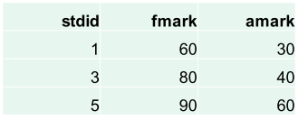
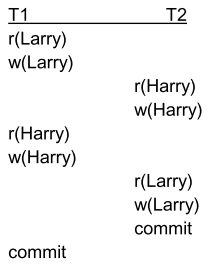
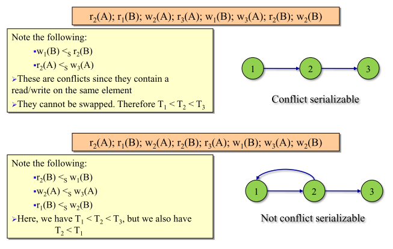
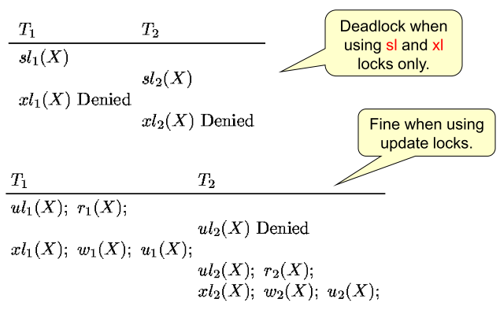
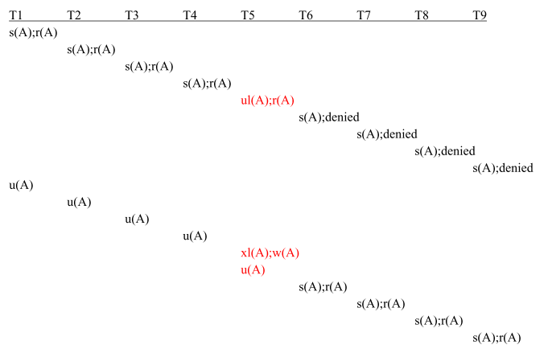

# (CSC 370) Database Systems - Complete Notes - Spring 2023
[TOC]

- [Class Intro](#class-intro)
  * [Content](#content)
  * [Textbooks](#textbooks)
  * [Assignments](#assignments)
  * [Course Evaluation](#course-evaluation)
  * [Lecture Slides](#lecture-slides)
- [Entity-Relationship Model](#entity-relationship-model)
  * [Database design](#database-design)
  * [Elements of the Entity-Relationship Model](#elements-of-the-entity-relationship-model)
      - [Example](#example)
  * [Visualizing Binary Entity-Relationship Relationships](#visualizing-binary-entity-relationship-relationships)
  * [Multiplicity of Relationships](#multiplicity-of-relationships)
      - [Many-To-One](#many-to-one)
      - [One-To-One](#one-to-one)
      - [Many-To-Many](#many-to-many)
  * [Why some studio-movie-star triples can be invalid?](#why-some-studio-movie-star-triples-can-be-invalid-)
  * [Attributes on Relationships](#attributes-on-relationships)
  * [Roles in a Relationship](#roles-in-a-relationship)
  * ["Bars-Beer-Drinkers" Example](#-bars-beer-drinkers--example)
      - ["Bar-Beers-Drinkers" Multiway Relationship](#-bar-beers-drinkers--multiway-relationship)
  * [A Typical Relationship Set](#a-typical-relationship-set)
  * [Multiple Relationships Between Two Entity Sets](#multiple-relationships-between-two-entity-sets)
  * [“Exactly one” Multiplicity](#-exactly-one--multiplicity)
  * [Exercise 1](#exercise-1)
  * [Exercise 2](#exercise-2)
  * [Keys](#keys)
  * [Keys for Movies](#keys-for-movies)
  * [Keys for Studios and Stars](#keys-for-studios-and-stars)
  * [Surrogate Keys](#surrogate-keys)
  * [Entity Sets Versus Attributes I](#entity-sets-versus-attributes-i)
  * [Entity Sets Versus Attributes II](#entity-sets-versus-attributes-ii)
  * [Subclasses](#subclasses)
  * [Inheritance in the Entity-Relationship Model](#inheritance-in-the-entity-relationship-model)
  * [Keys for entity set Hierarchies](#keys-for-entity-set-hierarchies)
  * [Weak Entity Sets](#weak-entity-sets)
  * [In Entity-Relationship Diagrams](#in-entity-relationship-diagrams)
  * [Weak Entity-Set Rules](#weak-entity-set-rules)
- [From Entity-Relationship Diagrams to Relations](#from-entity-relationship-diagrams-to-relations)
  * [Relations (or Tables) Terminology](#relations--or-tables--terminology)
  * [Terminology](#terminology)
  * [From Entity-Relationship Diagrams to Relations](#from-entity-relationship-diagrams-to-relations-1)
      - [Example 1: Entity Sets to Relations](#example-1--entity-sets-to-relations)
      - [Example 2: With Attribute Renaming](#example-2--with-attribute-renaming)
      - [Example 3](#example-3)
      - [Example 4](#example-4)
  * [Handling Weak Entity Sets](#handling-weak-entity-sets)
      - [Example 1](#example-1)
      - [Example 2](#example-2)
      - [Example 3](#example-3-1)
      - [Example 4](#example-4-1)
      - [Example 5 ("Isa")](#example-5---isa--)
  * [The 00 Approach](#the-00-approach)
  * [Entity-Relationship Approach](#entity-relationship-approach)
  * [Entity-Relationship approach - Remarks](#entity-relationship-approach---remarks)
  * [Comparison of Approaches](#comparison-of-approaches)
      - [OO translation drawback:](#oo-translation-drawback-)
      - [E/R translation drawback:](#e-r-translation-drawback-)
      - [OO translation advantage:](#oo-translation-advantage-)
      - [E/R translation advantage:](#e-r-translation-advantage-)
        * [Comparison Examples](#comparison-examples)
  * [Null Values to Combine Relations](#null-values-to-combine-relations)
- [SQL](#sql)
  * [Create Table](#create-table)
  * [CHAR and VARCHAR](#char-and-varchar)
  * [Insert - Studios](#insert---studios)
  * [Insert - Movies](#insert---movies)
  * [Insert - Stars](#insert---stars)
  * [Insert - StarsIn](#insert---starsin)
  * [Create Table with Primary Keys](#create-table-with-primary-keys)
  * [Create Table with Foreign Keys](#create-table-with-foreign-keys)
  * [Short Form for Single Att. Foreign Keys](#short-form-for-single-att-foreign-keys)
  * [Creation and insertion order](#creation-and-insertion-order)
  * [Dropping Tables](#dropping-tables)
  * [Getting all the tuples of a table](#getting-all-the-tuples-of-a-table)
  * [Altering Table Structure](#altering-table-structure)
- [Relational Algebra](#relational-algebra)
  * [Operations in the Relational Model](#operations-in-the-relational-model)
  * [Operations](#operations)
      - [Usual set opperations](#usual-set-opperations)
      - [Operations that remove parts of a relation:](#operations-that-remove-parts-of-a-relation-)
      - [Operations that combine the tuples of two relations:](#operations-that-combine-the-tuples-of-two-relations-)
      - [An operation called **“renaming”**](#an-operation-called----renaming---)
  * [Conditions for Set Operations on Relations](#conditions-for-set-operations-on-relations)
  * [Set Operations on Relations](#set-operations-on-relations)
  * [Projection](#projection)
      - [Example](#example-1)
  * [Selection](#selection)
      - [Example 1](#example-1-1)
      - [Example 2](#example-2-1)
  * [Cartesian Product](#cartesian-product)
      - [Example](#example-2)
  * [Theta-Join](#theta-join)
  * [Natural Join](#natural-join)
      - [Example](#example-3)
  * [Combing Operations to Form Queries](#combing-operations-to-form-queries)
      - [Example 1](#example-1-2)
      - [Example 2](#example-2-2)
      - [Example 2 (Alternative Solution 1)](#example-2--alternative-solution-1-)
      - [Example 2 (Alternative Solution 2)](#example-2--alternative-solution-2-)
  * [Renaming Operator](#renaming-operator)
      - [Problem](#problem)
- [Extended Relational Algebra](#extended-relational-algebra)
  * [Bags](#bags)
  * [Why Bags?](#why-bags-)
  * [Bag Union](#bag-union)
  * [Bag Intersection](#bag-intersection)
  * [Bag Difference](#bag-difference)
  * [Union, Intersection, Difference in SQL](#union--intersection--difference-in-sql)
  * [Extended Relational Algebra](#extended-relational-algebra-1)
  * [Example: Duplicate Elimination](#example--duplicate-elimination)
  * [Sorting](#sorting)
  * [Example: Extended Projection](#example--extended-projection)
  * [Aggregation Operators](#aggregation-operators)
  * [Example: Aggregation](#example--aggregation)
  * [Grouping Operator](#grouping-operator)
  * [Grouping Operator L(R) - Formally](#grouping-operator-l-r----formally)
  * [Example: Grouping/Aggregation](#example--grouping-aggregation)
  * [Outerjoin](#outerjoin)
  * [Example: Outerjoin](#example--outerjoin)
  * [Exercises](#exercises)
- [SQL Queries (sql2)](#sql-queries--sql2-)
  * [Select-From-Where Statements](#select-from-where-statements)
  * [(Extended) Projection in SQL](#-extended--projection-in-sql)
  * [WHERE in SQL](#where-in-sql)
      - [Example](#example-4)
  * [Selection in SQL](#selection-in-sql)
      - [Example](#example-5)
  * [Patterns in WHERE](#patterns-in-where)
      - [Example (Using patterns)](#example--using-patterns-)
  * [Ordering the Input](#ordering-the-input)
      - [Example 1](#example-1-3)
      - [Example 2](#example-2-3)
  * [Products and Joins in SQL](#products-and-joins-in-sql)
      - [Example 1](#example-1-4)
      - [Example 2](#example-2-4)
  * [Natural Join](#natural-join-1)
  * [Natural Join with USING](#natural-join-with-using)
  * [Join with ON](#join-with-on)
  * [Outer Joins](#outer-joins)
      - [Example](#example-6)
  * [Outer joins: Students example (I)](#outer-joins--students-example--i-)
  * [Outer joins: Students example (II)](#outer-joins--students-example--ii-)
  * [Outer joins: Students example (III)](#outer-joins--students-example--iii-)
  * [Outer joins: Students example (IV)](#outer-joins--students-example--iv-)
  * [Outer joins: Students example (V)](#outer-joins--students-example--v-)
  * [Outer joins: Students example (VI)](#outer-joins--students-example--vi-)
  * [Union/Intersection/Difference](#union-intersection-difference)
  * [Aliases](#aliases)
      - [Example](#example-7)
  * [Aggregations](#aggregations)
      - [Example](#example-8)
  * [Eliminating Duplicates in an Aggregation](#eliminating-duplicates-in-an-aggregation)
      - [Example](#example-9)
  * [Not only in COUNT…](#not-only-in-count-)
  * [Grouping](#grouping)
      - [Example](#example-10)
  * [Another Example](#another-example)
  * [HAVING Clauses](#having-clauses)
      - [Example](#example-11)
  * [Requirements on HAVING Conditions](#requirements-on-having-conditions)
  * [Restriction on SELECT Lists With Aggregation](#restriction-on-select-lists-with-aggregation)
  * [Illegal Query Example](#illegal-query-example)
  * [Exercise](#exercise)
  * [Correlated Subqueries](#correlated-subqueries)
  * [Another Solution (Nesting in FROM)](#another-solution--nesting-in-from-)
  * [Views](#views)
      - [Example](#example-12)
  * [Accessing a View](#accessing-a-view)
      - [Example 1](#example-1-5)
      - [Example 2](#example-2-5)
  * [View on more than one relation](#view-on-more-than-one-relation)
  * [EXISTS / NOT EXISTS](#exists---not-exists)
- [NULLs in SQL (sql3)](#nulls-in-sql--sql3-)
  * [NULL Values](#null-values)
  * [Comparing NULL’s to Values](#comparing-null-s-to-values)
  * [Three-Valued Logic](#three-valued-logic)
      - [Example](#example-13)
  * [Surprising Example](#surprising-example)
  * [Checking for NULLs](#checking-for-nulls)
      - [Example](#example-14)
  * [NULL’s Ignored in Aggregation](#null-s-ignored-in-aggregation)
  * [Example: Effect of NULL’s](#example--effect-of-null-s)
- [Database Modifications (sql4)](#database-modifications--sql4-)
  * [Database Modifications](#database-modifications)
  * [Insertion](#insertion)
      - [Example](#example-15)
  * [Specifying Attributes in INSERT](#specifying-attributes-in-insert)
  * [Inserting Many Tuples](#inserting-many-tuples)
  * [Deletion](#deletion)
  * [Example: Delete all Tuples](#example--delete-all-tuples)
  * [Updates](#updates)
  * [Another Example](#another-example-1)
- [Constraints (Primary Key, Unique, Foreign Key, Not Null)](#constraints--primary-key--unique--foreign-key--not-null-)
  * [Primary Keys](#primary-keys)
  * [NOT NULL](#not-null)
  * [UNIQUE](#unique)
  * [Constraint names](#constraint-names)
  * [Dropping/Adding Constraints](#dropping-adding-constraints)
  * [Listing constraints](#listing-constraints)
  * [Foreign key constraints](#foreign-key-constraints)
  * [Longer syntax for foreign keys](#longer-syntax-for-foreign-keys)
  * [Satisfying a Foreign key constraint](#satisfying-a-foreign-key-constraint)
  * [Foreign key constraints (cont.)](#foreign-key-constraints--cont-)
  * [Chicken and egg](#chicken-and-egg)
  * [Some first attempt](#some-first-attempt)
  * [However, inserting fails…](#however--inserting-fails-)
  * [Deferrable Constraints](#deferrable-constraints)
  * [Initially Deferred / Initially Immediate](#initially-deferred---initially-immediate)
  * [Successful Insertions](#successful-insertions)
  * [Dropping](#dropping)
- [Constraints (CHECK)](#constraints--check-)
  * [Check Constraints](#check-constraints)
  * [Checking](#checking)
  * [Check Constraints (cont’d)](#check-constraints--cont-d-)
  * [Writing Constraints Correctly](#writing-constraints-correctly)
  * [Exercise – mutually exclusive subclasses](#exercise---mutually-exclusive-subclasses)
- [Constraints (Enforcing business rules with **views**)](#constraints--enforcing-business-rules-with---views---)
  * [Updateable Views - **WITH CHECK OPTION**](#updateable-views-----with-check-option--)
  * [Views with check option for specialized constraints](#views-with-check-option-for-specialized-constraints)
  * [Another example: Cars](#another-example--cars)
  * [Another Example](#another-example-2)
    + [Exercise – Hotel Stays](#exercise---hotel-stays)
    + [Exercise – Hotel Stays – Inserting](#exercise---hotel-stays---inserting)
- [MIDTERM 1 Review (SQL Review)](#midterm-1-review--sql-review-)
  * [Create Table with Foreign Keys](#create-table-with-foreign-keys-1)
  * [Insert – Studios](#insert---studios)
  * [Insert – Movies](#insert---movies)
  * [Insert – Stars](#insert---stars)
  * [Insert – StarsIn](#insert---starsin)
  * [Creation and insertion order](#creation-and-insertion-order-1)
  * [Ordering the Input](#ordering-the-input-1)
  * [Natural Join with USING](#natural-join-with-using-1)
  * [Join with ON](#join-with-on-1)
  * [Outer Joins](#outer-joins-1)
  * [Union/Intersection/Difference](#union-intersection-difference-1)
  * [Aliases](#aliases-1)
  * [Grouping](#grouping-1)
  * [Another Example](#another-example-3)
  * [HAVING Clauses](#having-clauses-1)
  * [Requirements on HAVING Conditions](#requirements-on-having-conditions-1)
  * [Restriction on SELECT Lists With Aggregation](#restriction-on-select-lists-with-aggregation-1)
  * [Exercise](#exercise-1)
  * [Correlated Subqueries](#correlated-subqueries-1)
  * [Another Solution (Nesting in FROM)](#another-solution--nesting-in-from--1)
  * [Views](#views-1)
  * [Constraints – mutually exclusive subclasses](#constraints---mutually-exclusive-subclasses)
- [Illegal View Operations](#illegal-view-operations)
  * [Another example: Cars](#another-example--cars-1)
  * [Old Midterm 1](#old-midterm-1)
    + [Question 1](#question-1)
    + [Question 2](#question-2)
    + [Question 3](#question-3)
- [Security and Authorization (Security)](#security-and-authorization--security-)
  * [Introduction to DB Security](#introduction-to-db-security)
  * [Access Controls](#access-controls)
  * [Discretionary Access Control](#discretionary-access-control)
  * [GRANT Command](#grant-command)
  * [Grant Examples I](#grant-examples-i)
  * [Grant Examples II](#grant-examples-ii)
  * [Grant Examples III](#grant-examples-iii)
  * [Grant Examples IV](#grant-examples-iv)
  * [Grant Examples V](#grant-examples-v)
  * [Role-Based Authorization](#role-based-authorization)
  * [Revoke Examples](#revoke-examples)
  * [Privilege Descriptors](#privilege-descriptors)
  * [Authorization Graphs](#authorization-graphs)
  * [Effects of Revocations I](#effects-of-revocations-i)
  * [Effects of Revocations II](#effects-of-revocations-ii)
  * [Grant and Revoke on Views](#grant-and-revoke-on-views)
  * [Revoking REFERENCES privilege](#revoking-references-privilege)
  * [The problem with DAC](#the-problem-with-dac)
  * [Mandatory Access Control](#mandatory-access-control)
  * [Bell-LaPadula Model](#bell-lapadula-model)
  * [Statistical Databases](#statistical-databases)
- [Data Analysis with SQL (sql_time)](#data-analysis-with-sql--sql-time-)
  * [Example: Insert](#example--insert)
  * [Format](#format)
  * [Extract info from date](#extract-info-from-date)
  * [Orders, Orderlines, Products](#orders--orderlines--products)
  * [How do the number of orders and average order price vary by day of the year?](#how-do-the-number-of-orders-and-average-order-price-vary-by-day-of-the-year-)
  * [Chart](#chart)
  * [How many orders are placed on each day of the week?](#how-many-orders-are-placed-on-each-day-of-the-week-)
  * [How many orders are placed on each day of the week? – Horizontally](#how-many-orders-are-placed-on-each-day-of-the-week----horizontally)
  * [Has the number of orders by day of the week changed over the years?](#has-the-number-of-orders-by-day-of-the-week-changed-over-the-years-)
  * [Alternative + Excel Pivot](#alternative---excel-pivot)
  * [What is the number of orders by quarter of each year?](#what-is-the-number-of-orders-by-quarter-of-each-year-)
  * [What is the product category of the most popular product during each month?](#what-is-the-product-category-of-the-most-popular-product-during-each-month-)
  * [What is the frequency of each product in each month?](#what-is-the-frequency-of-each-product-in-each-month-)
  * [Results](#results)
  * [What is the maximum frequency in each month?](#what-is-the-maximum-frequency-in-each-month-)
  * [Results](#results-1)
  * [What is the product category of the most popular product during each month?](#what-is-the-product-category-of-the-most-popular-product-during-each-month--1)
  * [Results](#results-2)
  * [Chart](#chart-1)


# Class Intro

>  Alex Thomo (thomo@uvic.ca)
>
> Office Hours:
>
> - Tuesday 9:00am-10:00am (https://uvic.zoom.us/j/81584166127)
> - Friday 9:00am-10:00am (https://uvic.zoom.us/j/81584166127)

## Content

This course is an introduction to database systems. Topics include database design, query languages, query optimization, concurrency control, and recovery from failures.

- Database design
- Relational Algebra
- SQL
- Data Analytics
- Security
- Query evaluation
- Transaction Management
- Recovery from System Failures

## Textbooks

**Database Systems: The Complete Book** - by Hector Garcia-Molina, Jeffrey D. Ullman, and Jennifer D. Widom Prentice Hall, 2nd Edition, ISBN: 0131873253

## Assignments

## Course Evaluation

- Assignments (20%) - (4 x 5%) 
- Midterm (25%)
- Final exam (55%)

## Lecture Slides

[Lecture 0](assets/L0.pdf) - Entity-Relationship Model

[Lecture 1](assets/L1.pdf) - From E/R Diagrams to Relations

[Lecture 2](assets/L2.pdf) - SQL


# Entity-Relationship Model

## Database design 

- designing a database:
  - what **information** the database must hold
  - what **relationships** are there among components of that information.
- Notation for expressing designs: **<u>Entity-Relationship (E/R) model</u>**


## Elements of the Entity-Relationship Model

| Name          | Shape/Color      | Example                                                      |
| ------------- | ---------------- | ------------------------------------------------------------ |
| Entity Sets   | Square / Green   |  |
| Attributes    | Circle / White   |  |
| Relationships | Diamond / Yellow |  |

#### Example


## Visualizing Binary Entity-Relationship Relationships

- They are just sets of pairs:

| Movies         | Stars                 |
| -------------- | --------------------- |
| Basic Instinct | Sharon Stone          |
| Total recall   | Arnold Schwarzenegger |
| Total recall   | Sharon Stone          |

## Multiplicity of Relationships

#### Many-To-One


#### One-To-One


#### Many-To-Many


**Note:** Sometimes binary relationships aren’t enough!

Ex. 


>  Q: What could go wrong with this design? 
>
> A: Problem with finding which stars a studio is paying for a given movie.

## Why some studio-movie-star triples can be invalid?

Example:

**Carolco Pictures** paid **Arnold Schwarzenegger** for **Total Recall TriStar** paid **Sharon Ston**e for **Total Recall**.

- Using “Owns” and “Stars-In” we will have the following triples: (CP, TR, AS) <u>(CP, TR, SS)</u> <u>(TS, TR, AS)</u> (TS, TR, SS)

- The <u>second</u> and the <u>third</u> triples aren’t valid.
- If we consider the collection of all the valid triples, it is nothing else but a **three way relationship** between **Studios, Movies** and **Stars**

Solution: (Three way relationship)


## Attributes on Relationships


## Roles in a Relationship

- An entity set can appear two or more times in a relationship. 
- Each line to the entity set represents a different role.


- A movie may have **many sequels**, but for each sequel there is **only one original movie.**


## "Bars-Beer-Drinkers" Example

- Bars sell some beers.
- Drinkers like some beers.
- Drinkers frequent some bars.
- What would the E/R diagram be?


#### "Bar-Beers-Drinkers" Multiway Relationship

Suppose that drinkers will only drink certain beers at certain bars.


## A Typical Relationship Set

| Bar       | Drinker | Beer       |
| --------- | ------- | ---------- |
| Joe's Bar | Ann     | Miller     |
| Sue's Bar | Ann     | Bud        |
| Sue's Bar | Ann     | Pete's ale |
| Joe's Bar | Bob     | Bud        |
| Joe's Bar | Bob     | Miller     |
| Joe's Bar | Cal     | Miller     |
| Sue's Bar | Cal     | Bud Lite   |

## Multiple Relationships Between Two Entity Sets


## “Exactly one” Multiplicity


- Some beers are not the best-seller of any manufacturer, so a rounded arrow to Manfs would be inappropriate.
- But a manufacturer has to have a best-seller.

## Exercise 1

- Let us design a database for a bank, including information about customers and their accounts. Information about a customer includes their name, address, phone, and SIN number. Accounts have numbers, types (e.g., savings, checking) and balances. We also need to record the customer(s) who own an account. Draw the E/R diagram for this database.
- Modify your solution as follows: 
  - a) Change your diagram so an account can have only one customer. 
  - b) Change your diagram so that a customer can have a set of addresses (which are street-city-province triples) and a set of phones. Remember that we do not allow attributes to have nonatomic types, such as sets, in the E/R model.
  - c) Further modify your diagram so that customers can have a set of addresses, and at each address there is a set of phones.

## Exercise 2

- Give an E/R diagram for a database recording information about teams, players, and their fans, including: 

  1. For each team, its name, its players, its team captain (one of its players), and the colors of its uniform.

  2. For each player, his/her name. 
  3. For each fan, his/her name, favorite teams, favorite players, and favorite color.

- Suppose we wish to add to the schema a relationship “Led-by” among two players and a team. The intention is that this relationship set consists of triples
  (player1, player2, team) such that player 1 played on the team at a time when some other player 2 was the team captain. 

- Draw the modification to the E/R diagram.

## Keys

- A key (for an entity set) is a set of attributes such that no two entities are the same on all the attributes of the key.
- In Entity-Relationship, we underline the key attribute(s).


## Keys for Movies

- Let’s consider the entity set **Movie**.
- We might assume that the attribute title is a key. However, there can be different movies with the same name:
  - “Godzilla” has several different versions (Japanese, American etc.).
- If we **enforce** in the database a **key constraint** on attribute **title** of **Movie** class, then the DBMS will not allow us to insert information about different “Godzilla’s”.
- A better choice is to take the set {title, year} of attributes as a key.
  - We still run the risk that there are two movies made in the same year, with the same title, but that’s very unlikely.

## Keys for Studios and Stars

- For **Studios**:
  - Reasonable to assume that there are no two studios having the **same name**.
  - So, we will enforce **name** to serve as a **key**.
- For **Stars**:
  - We may think that the name can’t serve to distinguish two people, but…
  - Yes! For stars the name distinguishes them since traditionally they choose “stage names”.
  - So, again here, we will enforce **name** to serve as a **key.**

## Surrogate Keys

- Often, people introduce attributes whose role is to serve as a key for classes. 
  - Companies assign employee ID’s to all employees, and these ID’s are carefully chosen to be unique numbers.
  - In Canada everyone has a SIN. 
  - Students ID’s in universities
  - Driver’s license numbers
  - Automobile registration numbers

## Entity Sets Versus Attributes I

> Example: (Bad Design)
>
> 
>
> 1. Repeats the manufacturer’s address once for each beer; 
> 2. Loses the address if there are temporarily no beers for a manufacturer.

## Entity Sets Versus Attributes II

- An entity set should satisfy at least one of the following conditions:
  - It is more than the name of something; it has at least one nonkey attribute.
  - It is the “many” in a many-one or many-many relationship.

> Example: (Good Design)
>
> 
>
> - Manfs deserves to be an entity set because of the nonkey attribute addr.
> - Beers deserves to be an entity set because it is the “many” of the many-one relationship ManfBy.

## Subclasses

- Sometimes, a class (entity set) contains certain objects (entities) that have special properties not associated with all members of the class.


## Inheritance in the Entity-Relationship Model

- E/R entities have components in all subclasses to which they belong.

> Example: 
>
> Roger Rabit, which is both a <u>cartoon</u> and <u>murder-mystery</u>
>
> - will have components in all three entity sets: **Movies**, **Cartoons**, **Murder-Mysteries**.
> - i.e. it will have all four attributes of **Movies**, the attribute **weapon**, and finally will participate in the relationship **voices**.
>
> 

## Keys for entity set Hierarchies

- **Key of root is key for all.**
  - Ex. **{title,year}** is the key for **Movies**, **Cartoons** and **Murder-Mysteries**.


## Weak Entity Sets

- Occasionally, entities of an entity set need “help” to identify them uniquely.
- Entity set E is said to be weak if:
  - in order to identify entities of E uniquely, we need to follow one or more many-one relationships from E and include the key of the related entities from the connected entity sets.

> Example: Weak Entity Sets
>
> - **name** is almost a key for **football players**, but there might be two with the same name.
> - **number** is certainly not a key, since players on two teams could have the same number.
> - But **number**, together with the team **name** related to the player by **Plays-on** should be unique.

## In Entity-Relationship Diagrams


- Double diamond for **supporting** many-one relationship.
- Double rectangle for the weak entity set.

## Weak Entity-Set Rules

- A weak entity set has one or more many-one relationships to other
  (supporting) entity sets.
  - Not every many-one relationship from a weak entity set need be supporting.
  - But supporting relationships must have a rounded arrow (entity at the “one” end is guaranteed).
- The key for a weak entity set is its own underlined attributes and the keys for the supporting entity sets.
  - E.g., (player) **number** and (team) **name** is a key for **Players** in the previous example.

# From Entity-Relationship Diagrams to Relations


## Relations (or Tables) Terminology


## Terminology

Every attribute has an atomic type.

- **Relation Schema:** relation name + attribute names + attribute types
- **Relation instance:** a set of tuples. Only one copy of any tuple! 
- **Database Schema:** a set of relation schemas. 
- **Database instance**: a relation instance for every relation in the schema.

## From Entity-Relationship Diagrams to Relations

- **Entity sets** become relations with the same set of attributes.
- **Many-Many Relationships** become relations whose attributes are only:
  -  The keys of the connected entity sets.
  - Attributes of the relationship itself.
  - Sometimes attribute renaming needed to avoid name clashes.
- **Many-One Relationships** usually don’t need separate tables.
  - The key of the “one” side is included in the relation of the “many” side
- **One-One Relationships** are similar.
- **Ternary (or higher) relationships** need separate tables with keys of the participating entity sets. 
  - The key is the union of keys of the “many” sides.

#### Example 1: Entity Sets to Relations


#### Example 2: With Attribute Renaming


#### Example 3


#### Example 4


## Handling Weak Entity Sets

- Relation for a weak entity set must include attributes for its complete key (including those belonging to other entity sets), as well as its own, nonkey attributes.
- A supporting (double-diamond) relationship is redundant and yields no relation.

#### Example 1


#### Example 2


#### Example 3


#### Example 4


#### Example 5 ("Isa")


## The 00 Approach

- Every subclass has its own relation.
  - All the properties of that subclass, including all its inherited properties, are represented in this relation.

> Example:
>
> Movies( title, year, length, filmType ) 
>
> Cartoons( title, year, length, filmType ) 
>
> MurderMysteries( title, year, length, filmType, weapon) 
>
> Cartoon-MurderMysteries( title, year, length, filmType, weapon) 
>
> Voices( title, year, starName )

- Can we merge Cartoons with Movies?
  - If we do, we lose information about which moves are cartoons.

## Entity-Relationship Approach

- We will have the following relations:
  - Movies(title, year, length, filmType).
  - MurderMystery(title, year, weapon).
  - Cartoons(title, year).
  - Voices(title, year, name).

## Entity-Relationship approach - Remarks

- No relation for class Cartoon-MurderMystery.
- For a movie that is both, we obtain:
  - its voices from the Voices relation
  - its weapon from the MurderMystery relation
  - and all other information from the Movies relation.
- Relation Cartoons has a schema that is a subset of the schema for the relation Voices. *Should we eliminate the relation Cartoons?*
- However there may be **silent** cartoons in our database. Those cartoons would have no voices and we would lose them.

## Comparison of Approaches

#### OO translation drawback:

- Too many tables! Why?
  - In the OO approach if we have a root and n children we need 2^n different tables!!!

#### E/R translation drawback: 

 We may have to look in several relations to gather information about a single object.

- For example, if we want the length and weapon used for a murder mystery film, we have to look at Movies and MurderMysteries relations.

#### OO translation advantage: 

- The OO translation keeps all properties of an object together in one relation.

#### E/R translation advantage: 

- The E/R translation allows us to find in one relation tuples from all classes in the hierarchy.

##### Comparison Examples

- <u>What movies of 2009 were longer than 150 minutes?</u>
  - Can be answered directly in the E/R approach.
  - In the OO approach we have to examine all the relations.
- <u>What weapons were used in cartoons of over 150 minutes in length?</u>
  - More difficult in the E/R approach. 
    - We should access Movies to find those of over 150 mins.
    - Then, we have to access Cartoons to see if they are cartoons.
    - Then we should access MurderMysteries to find the weapon.
  - In OO approach we need only access the Cartoon-MyrderMysteries table.

## Null Values to Combine Relations

- If we are **allowed** to use **NULL** in tuples, we can handle a hierarchy of classes with a single relation.
  - This relation has attributes for all the properties possessed by objects in any of the classes of the hierarchy.
  - An object is represented by a single tuple. This tuple has NULL in each attribute corresponding to a property that does not belong to the object’s class.
- If we apply this approach to the Movie hierarchy, we would create a single relation whose schema is:
  - **Movie**(title, year, length, filmType, studioName, starName, voice, weapon) 
    - “Who Framed Roger Rabbit?”, being both a cartoon and a murder-mystery, would be represented by several tuples that had no NULL’s.
    - The Little Mermaid, being a cartoon but not a murder-mystery, would have NULL in the weapon component.
- This approach allows us to find **all** the information about an object in one relation. Drawback?
  - Depending on the data, there could be too many nulls.

# SQL 

## Create Table

```sql
CREATE TABLE Studios( 
    name VARCHAR(20), 
    website VARCHAR(255)
);

CREATE TABLE Stars ( name VARCHAR(20), gender CHAR(1), birthyear INT, birthplace VARCHAR(40));

CREATE TABLE Movies ( title VARCHAR(50), year INT, length INT, rating CHAR(2), studioname VARCHAR(20));

CREATE TABLE StarsIn ( title VARCHAR(50), year INT, starname VARCHAR(20));
```

## CHAR and VARCHAR

- **CHAR(n)** allocates a fixed space, and if the string that we store is shorter than **n**, then it is padded with blanks.
- Differently, **VARCHAR(n)** denotes a string of up to **n** characters.
  - VARCHAR(n) allows for compression to save space.
- Use CHAR(n) for frequently used fields, and use VARCHAR(n) otherwise.

## Insert - Studios

```sql
INSERT INTO Studios 
VALUES('Fox', 'foxmovies.com');

INSERT INTO Studios 
VALUES('Disney', 'disney.com');

INSERT INTO Studios 
VALUES('Paramount', 'www.paramount.com');
```

## Insert - Movies

```sql
INSERT INTO Movies 
VALUES('Walk the Line', 2005, 136, 'PG', 'Fox');

INSERT INTO Movies 
VALUES('Pretty Woman', 1990, 119, 'R', 'Disney');

INSERT INTO Movies 
VALUES('Wayne''s World', 1991, 104, 'PG', 'Paramount');

INSERT INTO Movies 
VALUES('Unfaithful', 2002, 124, 'R', 'Fox');

INSERT INTO Movies 
VALUES('Runaway Bride', 1999, 116, 'PG', 'Paramount');

INSERT INTO Movies 
VALUES('The Princess and the Frog', 2009, 97, 'G', 'Disney');
```

## Insert - Stars

```sql
INSERT INTO Stars 
VALUES('Richard Gere', 'M', 1949, 'Philadelphia, Pennsylvania, USA');

INSERT INTO Stars 
VALUES('Joaquin Phoenix', 'M', 1974, 'San Juan, Puerto Rico');

INSERT INTO Stars 
VALUES('Reese Witherspoon', 'F', 1976, 'Baton Rouge, Louisiana, USA');

INSERT INTO Stars 
VALUES('Julia Roberts', 'F', 1967, 'Smyrna, Georgia, USA');

INSERT INTO Stars 
VALUES('Mike Myers', 'M', 1963, 'Scarborough, Ontario, Canada');

INSERT INTO Stars 
VALUES('Oprah Winfrey', 'F', 1954, 'Kosciusko, Mississippi, USA');
```

## Insert - StarsIn

```sql
INSERT INTO StarsIn 
VALUES('Walk the Line', 2005, 'Joaquin Phoenix'); 

INSERT INTO StarsIn 
VALUES('Walk the Line', 2005, 'Reese Witherspoon');

INSERT INTO StarsIn 
VALUES('Pretty Woman', 1990, 'Richard Gere'); 

INSERT INTO StarsIn 
VALUES('Pretty Woman', 1990, 'Julia Roberts');

INSERT INTO StarsIn 
VALUES('Wayne''s World', 1991, 'Mike Myers');

INSERT INTO StarsIn 
VALUES('Unfaithful', 2002, 'Richard Gere');

INSERT INTO StarsIn 
VALUES('Runaway Bride', 1999, 'Richard Gere');

INSERT INTO StarsIn 
VALUES('Runaway Bride', 1999, 'Julia Roberts'); 

INSERT INTO StarsIn 
VALUES('The Princess and the Frog', 2009, 'Oprah Winfrey');
```

## Create Table with Primary Keys

```sql
CREATE TABLE Studios(
    name VARCHAR(20) PRIMARY KEY, 
    website VARCHAR(255)
);

CREATE TABLE Stars (
    name VARCHAR(20) PRIMARY KEY, 
    gender CHAR(1), 
    birthyear INT, 
    birthplace VARCHAR(40)
);

CREATE TABLE Movies ( 
    title VARCHAR(50), 
    year INT, 
    length INT, 
    rating CHAR(2), 
    studioname VARCHAR(20), 
    PRIMARY KEY (title, year)
);

CREATE TABLE StarsIn (
    title VARCHAR(50), 
    year INT, 
    starname VARCHAR(20), 
    PRIMARY KEY (title,year,starname)
);


```

## Create Table with Foreign Keys

```sql
CREATE TABLE Studios(
    name VARCHAR(20) PRIMARY KEY, 
    website VARCHAR(255)
);

CREATE TABLE Stars (
    name VARCHAR(20) PRIMARY KEY, 
    gender CHAR(1), 
    birthyear INT, 
    birthplace VARCHAR(40)
);

CREATE TABLE Movies (
    title VARCHAR(50), 
    year INT, 
    length INT, 
    rating CHAR(2), 
    studioname VARCHAR(20), 
    PRIMARY KEY (title, year), 
    FOREIGN KEY (studioName) REFERENCES Studios(name) ON DELETE CASCADE
);

CREATE TABLE StarsIn (
    title VARCHAR(50), 
    year INT, 
    starname VARCHAR(20), 
    PRIMARY KEY (title,year,starname), 
    FOREIGN KEY (title,year) REFERENCES Movies(title,year) ON DELETE CASCADE, 
    FOREIGN KEY (starName) REFERENCES Stars(name) ON DELETE CASCADE
);
```

## Short Form for Single Att. Foreign Keys

```sql
CREATE TABLE Movies (
    title VARCHAR(50), 
    year INT, 
    length INT, 
    rating CHAR(2), 
    studioname VARCHAR(20) REFERENCES Studios(name) ON DELETE CASCADE, 
    PRIMARY KEY (title, year)
);
```

- No need to say Foreign Key

## Creation and insertion order

1. Movies after Studios
2. StarsIn after Movies and Stars

## Dropping Tables

```sql
DROP TABLE StarsIn; 

DROP TABLE Movies; 

DROP TABLE Stars; 

DROP TABLE Studios;
```

> Note: Order of drops is important if foreign key constraints are in place.

## Getting all the tuples of a table

```SQL
SELECT * FROM Movies;
```

## Altering Table Structure

```sql
ALTER TABLE Stars ADD phone CHAR(7); 

ALTER TABLE Stars MODIFY phone CHAR(10); 

ALTER TABLE Stars DROP COLUMN phone;
```

# Relational Algebra

## Operations in the Relational Model

- These operation can be expressed in an algebra, called **“relational algebra.”**
- In this algebra, **relations** are the **operands** and we apply **operators** on them.

## Operations

Four Broad classes:

#### Usual set opperations

- **Union**
- **Intersection**
- **Difference**

#### Operations that remove parts of a relation:

- **Selection** - eliminates some rows(tuples)
- **Projection** - eliminates some columns

#### Operations that combine the tuples of two relations:

- **Cartesian Product** - pairs tuples of two relations in all possible ways
- **Join** - selectively pairs tuples from two relations

#### An operation called **“renaming”**

## Conditions for Set Operations on Relations

We can apply union, intersection, difference- on relations R and S provided that:

1. **R** and **S** must have schemas with identical sets of attributes.
2. Before applying the operations, the columns of **R** and **S** must be ordered so that the order of attributes is the same for both relations.

## Set Operations on Relations

| Operation                                                    | Description                                                  |
| ------------------------------------------------------------ | ------------------------------------------------------------ |
|  | the **union** of **R** and **S**, is the set of tuples that are in **R** or **S** or both |
|  | the **intersection** of **R** and **S**, is the set of tuples that are in both **R** and **S**. |
|  | the **difference** of **R** and **S**, is the set of tuples that are in **R** but not in **S**. |

> Note:  that R -  S is different from S - R.

## Projection

| Operation                                                    | Description                                                  |
| ------------------------------------------------------------ | ------------------------------------------------------------ |
|  | Produces from relation **R** a new relation that has only the A1, …, An columns of **R**. |

#### Example


| Title        | Year | Length | FilmType | Studioname | Producer# |
| ------------ | ---- | ------ | -------- | ---------- | --------- |
| Star wars    | 1977 | 124    | color    | Fox        | 12345     |
| Mighty Ducks | 1991 | 104    | color    | Disney     | 67890     |
| Waynes world | 1992 | 95     | color    | Paramount  | 99999     |

We get:

| Title        | Year | Length |
| ------------ | ---- | ------ |
| Star wars    | 1977 | 124    |
| Mighty Ducks | 1991 | 104    |
| Waynes World | 1992 | 95     |

## Selection

| Operation                                                    | Description                                                  |
| ------------------------------------------------------------ | ------------------------------------------------------------ |
|  | Produces a new relation with those tuples of R which satisfy condition C. |

#### Example 1


| Title        | Year | Length | Filmtype | Studioname | Producer# |
| ------------ | ---- | ------ | -------- | ---------- | --------- |
| Star Wars    | 1977 | 124    | color    | Fox        | 12345     |
| Mighty Ducks | 1991 | 104    | color    | Disney     | 67890     |

#### Example 2

Suppose we want the movies by Fox which are at least 100 minutes long.


Results in:

| Title     | Year | Length | Filmtype | Studioname | Producer# |
| --------- | ---- | ------ | -------- | ---------- | --------- |
| Star Wars | 1977 | 124    | color    | Fox        | 12345     |

## Cartesian Product

| Operation                                                    | Description |
| ------------------------------------------------------------ | ----------- |
|  | See below   |

1. Set of tuples **rs** that are formed by choosing the first part (**r**) to be any tuple of **R** and the second part (**s**) to be any tuple of **S**
2. Schema for the resulting relation is the union of schemas for **R** and **S**.
3. If **R** and **S** happen to have some attributes in common, then prefix those attributes by the relation name.

#### Example

R = 

| A    | B    |
| ---- | ---- |
| 1    | 2    |
| 3    | 4    |

S = 

| A    | C    | D    |
| ---- | ---- | ---- |
| 2    | 5    | 6    |
| 4    | 7    | 8    |
| 9    | 10   | 11   |

R x S = 

| A    | R.B  | S.B  | CD   | D    |
| ---- | ---- | ---- | ---- | ---- |
| 1    | 2    | 2    | 5    | 6    |
| 1    | 2    | 4    | 7    | 8    |
| 1    | 2    | 9    | 10   | 11   |
| 3    | 4    | 2    | 5    | 6    |
| 3    | 4    | 4    | 7    | 8    |
| 3    | 4    | 9    | 10   | 11   |


## Theta-Join


- The result of this operation is constructed as follows: 

  - a) Take the Cartesian product of **R** and **S**.
  - b) Select from the product only those tuples that satisfy the condition **C**.

- Schema for the result is the union of the schema of **R** and **S** with, “**R**” or “**S**” prefix as necessary.

  

  When the condition is equality, we call it “equijoin”.

## Natural Join


- Let **A1, A2,…,An** be the attributes in both the schema of **R** and the schema of **S**.
- Then a tuple **r** from **R** and a tuple **s** from **S** are successfully paired if and only if **r** and **s** agree on each of the attributes **A1, A2, …, An.**

#### Example

The natural join of the relation R and S from previous example is:

| A    | B    | C    | D    |
| ---- | ---- | ---- | ---- |
| 1    | 2    | 5    | 6    |
| 3    | 4    | 7    | 8    |


## Combing Operations to Form Queries

#### Example 1

Question: “What are the title and years of movies made by Fox that are at least 100 minutes long?”


```sql
SELECT title, year 
FROM Movies 
WHERE length>=100 AND studioName=‘Fox’;
```

#### Example 2

Question: 

- Consider two relations Movies and StarsIn

- With schemas: 
  - Movies(title, year, length, filmType, studioName) 
  - StarsIn(title, year, starName)
- Suppose we want to know: 
  - “Find the stars of the movies that are at least 100 minutes long.”

> Note: 
>
> First we join the two relations: Movies, StarsIn 
>
> Second we select movies with length at least 100 min. 
>
> Then we project onto starName.


```sql
SELECT starName 
FROM Movies, StarsIn 
WHERE Movies.title=StarsIn.title 
AND Movies.year=StarsIn.year 
AND length>=100;
```

#### Example 2 (Alternative Solution 1)


```sql
SELECT starName
FROM Movies 
JOIN StarsIn 
ON Movies.title=StarsIn.title 
AND Movies.year=StarsIn.year
WHERE length>=100;
```

#### Example 2 (Alternative Solution 2)


```sql
SELECT starName 
FROM Movies 
JOIN StarsIn 
USING (title, year) 
WHERE length>=100;
```

OR (Less safe)

```sql
SELECT starName 
FROM Movies 
NATURAL JOIN StarsIn 
WHERE length>=100;
```


## Renaming Operator


- Resulting relation has exactly the same tuples as **R**, but the name of the relation is **S**.
- Moreover, the attributes of the result relation **S** are named **A1, A2, …, An,** in order from the left.

#### Problem

Product(maker, model, type) 

PC(model, speed, ram, hd, rd, price) 

Laptop(model, speed, ram, hd, screen, price)

Printer(model, color, type, price)


> a) Which PC models have a speed of at least 1000?
>
> b) Which manufacturers make laptops with a hard disk of at least 30?
>
> c) Find the model number and price of all products (of any type) made by manufacturer B.
>
> d) Find the model numbers of all color laser printers. 
>
> e) Find those manufacturers that sell Laptops, but not PC's. 
>
> !f) Find those hard-disk sizes that occur in two or more PC's. 
>
> !g) Find those pairs of PC models that have both the same speed and RAM. A pair should be listed once.
>
> !!h)Find those manufacturers of at least two different computers (PC or Laptops) with speed of at least 700.

# Extended Relational Algebra

## Bags

> **Bag**
>
> Is like a set, but an element may appear more than once.
>
> Note: Multiset is another name for “bag.”

Example:

- {1,2,1,3} is a bag.
- {1,2,3} is also a bag that happens to be a set.

Bags also resemble lists, but order in a bag is unimportant.

Example:

- {1,2,1} = {1,1,2} as bags, but
- [1,2,1] != [1,1,2] as lists.

## Why Bags?

- SQL is actually a bag language.
- SQL will eliminate duplicates, but usually only if you ask it to do so explicitly
  - except for **union, intersection**, and **difference** where the default is “set mode”.

> Note: Union, intersection, and difference need new definitions for bags.

## Bag Union

An element appears in the union of two bags the sum of the number of times it appears in each bag

> **Example:**
>
> {1,2,1} UNION {1,1,2,3,1} = {1,1,1,1,1,2,2,3}

## Bag Intersection

An element appears in the intersection of two bags the minimum of the number of times it appears in either.

> Example:
>
> {1,2,1} INTERSECT {1,2,3} = {1,2}.

## Bag Difference

An element appears in difference A – B of bags as many times as it appears in A, minus the number of times it appears in B.

- But never less than 0 times

> Example:
>
> {1,2,1} – {1,2,3} = {1}

## Union, Intersection, Difference in SQL

> Note: Remember, we need to have the same schema for the relations that we union, intersect, or take difference.

```sql
(SELECT * FROM R) 
UNION 
(SELECT * FROM S);

(SELECT * FROM R) 
INTERSECT 
(SELECT * FROM S);

(SELECT * FROM R) 
EXCEPT 
(SELECT * FROM S);
```

- Add “ALL” for bag version of these operators.
  - These are the only operators that work in ‘set mode’ by default.
  - All the others work in ‘bag mode’ by default.

## Extended Relational Algebra


## Example: Duplicate Elimination


- R1 consists of one copy of each tuple that appears in R2 one or more times.

R =

| A    | B    |
| ---- | ---- |
| 1    | 2    |
| 3    | 4    |
| 1    | 2    |

1*(R) = 

| A    | B    |
| ---- | ---- |
| 1    | 2    |
| 3    | 4    |

```SQL
SELECT DISTINCT * FROM R;
```

## Sorting


- L is a list of some of the attributes of R_2.
- R1 is the list of tuples of R2 sorted first on the value of the first attribute on L, then on the second attribute of L, and so on.
- the only operator whose result is neither a set nor a bag, but a **list**

```sql
SELECT * FROM R ORDER BY A, B;
```

## Example: Extended Projection


## Aggregation Operators

- They apply to entire columns of a table and produce a single result.
- Most important examples:
  - SUM
  - AVG
  - COUNT
  - MIN
  - MAX

## Example: Aggregation

R =

| A    | B    |
| ---- | ---- |
| 1    | 3    |
| 3    | 4    |
| 3    | 2    |

- SUM(A) = 7 
- COUNT(A) = 3 
- MAX(B) = 4 
- MIN(B) = 2 
- AVG(B) = 3

```SQL
SELECT SUM(A), COUNT(A), MAX(B), MIN(B), AVG(B) FROM R;
```


## Grouping Operator


## Grouping Operator L(R) - Formally

- Group relation R according to all the grouping attributes on list L.
  - That is, form one group for each distinct list of values for those attributes in R.
- Within each group, compute AGG(A) for each aggregation on list L.
- Result has grouping attributes and aggregations as attributes.
  - One tuple for each list of values for the grouping attributes and their group’s aggregations

## Example: Grouping/Aggregation

**StarsIn(title, year, starName)**

> How many movies each star has starred in?
>
> 


> What’s the earliest year each star has starred in some movie? 
>
> 


> How many stars have starred in in each movie?
>
> 

> For each star who has appeared in at least three movies give the earliest year in which he or she appeared.
>
> 
>
> Translating the previous RA expression to SQL:
>
> ```SQL
> SELECT starName, miny 
> FROM (SELECT starname, COUNT(title) AS cnt, 
>       MIN(year) AS miny 
>       FROM StarsIn 
>       GROUP BY starname)
> WHERE cnt>=3;
> ```
>
> OR
>
> ```SQL
> SELECT starname, MIN(year) AS miny 
> FROM StarsIn 
> GROUP BY starname 
> HAVING COUNT(title)>=3;
> ```
>
> 

## Outerjoin

**Motivation** 

- Suppose we join R S.
- A tuple of R which doesn't join with any tuple of S is said to be dangling.
  - Similarly for a tuple of S.
  - **Problem**: We loose dangling tuples.

**Outerjoin** 

- Preserves dangling tuples by padding them with NULL in the result.

## Example: Outerjoin

R = 

| A    | B    |
| ---- | ---- |
| 1    | 2    |
| 4    | 5    |

S = 

| A    | C    |
| ---- | ---- |
| 2    | 3    |
| 6    | 7    |

(1,2) joins with (2,3), but the other two tuples are dangling.

R OUTRJOIN S = 

| A    | B    | C    |
| ---- | ---- | ---- |
| 1    | 2    | 3    |
| 4    | 5    | NULL |
| NULL | 6    | 7    |

```SQL
SELECT * FROM R FULL OUTER JOIN S USING(B);
```

## Exercises


# SQL Queries (sql2)

## Select-From-Where Statements

Principal form of a query is:

```sql
SELECT desired attributes 
FROM one or more tables
WHERE condition about tuples of the tables
```

1. Begin with the relation in the FROM clause.
2. Apply the selection indicated by the WHERE clause.
3. Apply the projection indicated by the SELECT clause.

## (Extended) Projection in SQL

```SQL
SELECT title, length 
FROM Movies 
WHERE studioName = 'Disney';

SELECT title AS name, length AS duration 
FROM Movies 
WHERE studioName = 'Disney';

SELECT title AS name, length*0.016667 AS lenghtInHours 
FROM Movies 
WHERE studioName = 'Disney';

SELECT title AS name, length/60.0 AS length, 'hrs.' AS inHours
FROM Movies 
WHERE studioName = 'Disney';
```

## WHERE in SQL

Build expressions by using the operators:

> =, <>, <,>,<=,>=

- String constants are surrounded by **single quotes.**
  - studioName = 'Disney'
- Numeric constants are for e.g.: -12.34, 1.23E45
- Boolean operators are: AND, OR, NOT.

#### Example

Which movies are made by Disney and aren't rated ‘G’?

```sql
SELECT title 
FROM Movies
WHERE (studioname = 'Disney') AND NOT (rating='G');
```


## Selection in SQL

#### Example

Which Disney movies are after 1970 or have length greater than 90 mins?

```SQL
SELECT title 
FROM Movies
WHERE (year > 1970 OR length < 90) AND studioName='Disney';
```

> Note: Parenthesis are needed because the precedence of OR is less than that of AND.

## Patterns in WHERE

- General Form:
  - <Attribute> LIKE <pattern> 
  - <Attribute> NOT LIKE <pattern>

> <pattern> is a quoted string which may contain:
>
> - % = meaning “any string”
> - _ = meaning “any character.”

#### Example (Using patterns)

Suppose we remember a movie “Princess something”.

```SQL
SELECT title 
FROM Movies
WHERE title LIKE '%Princess%';
```

or

```SQL
SELECT title 
FROM Movies
WHERE lower(title) LIKE '%princess%';
```

## Ordering the Input

#### Example 1

Find the Disney movies and list them by length, shortest first.

```SQL
SELECT * 
FROM Movies 
WHERE studioName = 'Disney' 
ORDER BY length;
```

#### Example 2

Find the Disney movies and list them by length, shortest first, and among movies of equal length, sort alphabetically.

```SQL
SELECT * 
FROM Movies 
WHERE studioName = 'Disney' 
ORDER BY length, title;
```

> Note:
>
> - Ordering is ascending, unless you specify the DESC keyword after an attribute.
> - Ties are broken by the second attribute on the ORDER BY list, etc.

## Products and Joins in SQL

- SQL has a simple way to couple tables: list them in the FROM clause.
  - All the tables in the FROM clause are coupled through Cartesian product
  - Then we can put conditions in the WHERE clause in order to get the desired kind of join.

#### Example 1

We want to know the website of the studio of Pretty Woman.

```SQL
SELECT website 
FROM Movies, Studios
WHERE title = 'Pretty Woman' AND studioName=name;
```

#### Example 2

We want to know the stars of Paramount movies.

```SQL
SELECT Stars.name, Stars.birthdate, Stars.birthplace 
FROM Movies, Stars, StarsIn 
WHERE studioname = 'Paramount' 
	AND StarsIn.title = Movies.title 
	AND StarsIn.year = Movies.year 
	AND StarsIn.starName = Stars.name;
```

- When we involve **two or more tables** in a query, we can have attributes with the same name among these relations.
  - **Solution:** We disambiguate by putting the name of the relation followed by a dot and then the name of the attribute.

## Natural Join

```SQL
SELECT * 
FROM Movies NATURAL JOIN StarsIn;
```

Possible because the join attributes have the same name Almost the same as:

```SQL
SELECT * 
FROM Movies, StarsIn 
WHERE Movies.title=StarsIn.title 
	AND Movies.year=StarsIn.year;
```

## Natural Join with USING

Better than NATURAL JOIN:

```SQl
SELECT * 
FROM Movies 
JOIN StarsIn USING (title,year);
```

Because now it is explicit which attributes are used to join the tables.

## Join with ON

A similar result can be obtained by:

```SQL
SELECT * 
FROM Movies 
JOIN StarsIn ON Movies.title=StarsIn.title AND
				Movies.year=StarsIn.year;
```

However, now we get two copies for title and year. This is exactly the same as:

```SQL
SELECT * 
FROM Movies, StarsIn 
WHERE Movies.title=StarsIn.title 
AND Movies.year=StarsIn.year;
```

## Outer Joins

```SQL
SELECT * 
FROM Movies 
NATURAL FULL OUTER JOIN StarsIn;
```

```SQl
SELECT * 
FROM Movies 
NATURAL LEFT OUTER JOIN StarsIn;
```

```SQL
SELECT * 
FROM Movies 
NATURAL RIGHT OUTER JOIN StarsIn;
```

- One of LEFT, RIGHT, or FULL before OUTER (but not missing). 
  - LEFT = pad dangling tuples of Movies only. 
  - RIGHT = pad dangling tuples of StarsIn only. 
  - FULL = pad both.

#### Example

Compare:

```SQL
SELECT * 
FROM Movies JOIN Studios 
	ON Movies.studioName = Studios.name;
```

```SQl
SELECT * 
FROM Movies LEFT OUTER JOIN Studios 
	ON Movies.studioName = Studios.name;
```

## Outer joins: Students example (I)

```SQl
CREATE TABLE Fexam (stdid INT PRIMARY KEY, mark INT); 
CREATE TABLE Assig ( stdid INT PRIMARY KEY, mark INT);

INSERT INTO Fexam VALUES(1,60); 
INSERT INTO Fexam VALUES(2,70); 
INSERT INTO Fexam VALUES(3,80); 
INSERT INTO Fexam VALUES(5,90);

INSERT INTO Assig VALUES(1,30); 
INSERT INTO Assig VALUES(3,40); 
INSERT INTO Assig VALUES(4,50); 
INSERT INTO Assig VALUES(5,60);
```

Suppose we want to join Fexam and Assig to get both marks for each student.

## Outer joins: Students example (II)

Suppose we start with:

```SQl
SELECT * FROM Fexam NATURAL JOIN Assig;
```

- Result? 
  - Empty.
- Why? 
  - Attribute mark used too for the join. It shouldn’t .

## Outer joins: Students example (III)

```SQl
SELECT * 
FROM Fexam 
JOIN Assig USING(stdid);
```


- Problem? 
  - Not clear which mark is fexam mark, which is assig mark.

## Outer joins: Students example (IV)

```SQL
SELECT stdid, Fexam.mark AS fmark, Assig.mark AS amark 
FROM Fexam 
JOIN Assig USING(stdid);
```



- Problem?
  - Student 2 and 4 are lost.

## Outer joins: Students example (V)

```SQL
SELECT stdid, Fexam.mark AS fmark, Assig.mark AS amark 
FROM Fexam 
FULL OUTER JOIN Assig USING(stdid);
```


## Outer joins: Students example (VI)

```SQl
SELECT Fexam.stdid, Fexam.mark AS fmark, Assig.mark AS amark 
FROM Fexam 
FULL OUTER JOIN Assig 
ON Fexam.stdid=Assig.stdid;
```


- Why did we get NULL for stdid of this tuple here?

  - Because that tuple has stdid=4 which is not in Fexam. Recall, we are printing Fexam.stdid We should change the query to:

  - ```SQl
    SELECT Fexam.stdid, Assig.stdid, Fexam.mark AS fmark, Assig.mark AS amark 
    FROM Fexam 
    FULL OUTER JOIN Assig 
    ON Fexam.stdid=Assig.stdid;
    ```

## Union/Intersection/Difference

- Find the movies where either Richard Gere or Julia Roberts star. 
- Find the movies where both Richard Gere and Julia Roberts star. 
- Find the movies where Richard Gere stars but Julia Roberts doesn’t.

```SQL
SELECT title, year 
FROM StarsIn 
WHERE starName='Richard Gere' 
UNION / INTERSECT / EXCEPT (use one of them depending on request)
	SELECT title, year 
	FROM StarsIn 
	WHERE starName='Julia Roberts' ;
```

## Aliases

- Sometimes we need to ask a query that combines a table with itself. 
  - We may list a table T as many times we want in the from clause but we need a way to refer to each occurrence of T.
  - SQL allows us to define, for each occurrence in the FROM clause, an alias (which is called “tuple variable”).

#### Example

Find pairs of stars who have played together in the same movie.

```SQl
SELECT S1.starname, S2.starname 
FROM StarsIn S1, StarsIn S2
WHERE S1.title = S2.title 
	AND S1.year = S2.year 
	AND S1.starname < S2.starname;
```

## Aggregations

- SUM, AVG, COUNT, MIN, and MAX can be applied to a column in a SELECT clause to produce that aggregation on the column.

#### Example

Find the average length of movies from Disney.

```SQl
SELECT AVG(length) 
FROM Movies
WHERE studioName = 'Disney';
```

## Eliminating Duplicates in an Aggregation

- DISTINCT inside an aggregation causes duplicates to be eliminated before the aggregation.

#### Example

```SQL
SELECT COUNT(DISTINCT studioName) 
FROM Movies;
```

**This is not the same as:**

```SQl
SELECT DISTINCT COUNT(studioName) 
FROM Movies;
```

## Not only in COUNT…

```SQL
SELECT AVG(DISTINCT length) 
FROM Movies 
WHERE studioname = 'Disney';
```

- This will produce the average of only the distinct values for length.

## Grouping

- What if we want to find the average movie length for each studio?
- We may follow the query by **GROUP BY** and a list of attributes.
- The result
  - is grouped according to the values of all the listed attributes in GROUP BY, and
  - any aggregation is applied only within each group.

#### Example

```SQL
SELECT studioName, AVG(length) 
FROM Movies 
GROUP BY studioName;
```

## Another Example

From Movies and StarsIn, find the star’s total length of film played.

```SQL
SELECT starName, SUM(length) 
FROM Movies, StarsIn 
WHERE Movies.title=StarsIn.title 
AND Movies.year=StarsIn.year 
GROUP BY starName;
```

## HAVING Clauses

HAVING <condition> may follow a GROUP BY clause.

- If so, the condition applies to each group, and groups not satisfying the condition are eliminated.

#### Example

```SQL
SELECT starName, SUM(length) 
FROM Movies, StarsIn 
WHERE Movies.title=StarsIn.title 
AND Movies.year=StarsIn.year 
GROUP BY starName;
```

Suppose we didn’t wish to include all the stars in our table of aggregated lengths. We want those stars that have at least one movie before 2000.

```SQL
SELECT starName, SUM(length) 
FROM Movies, StarsIn 
WHERE Movies.title=StarsIn.title 
AND Movies.year=StarsIn.year 
GROUP BY starName 
HAVING MIN(StarsIn.year) < 2000;
```

## Requirements on HAVING Conditions

- These conditions may refer to any relation in the FROM clause.
- They may refer to attributes of those relations, as long as the attribute makes sense within a group; i.e., it is either:
  -  A grouping attribute, or 
  - Aggregated attribute.

## Restriction on SELECT Lists With Aggregation

- If any aggregation is used, then each element of the SELECT list must be either:
  - Aggregated, or 
  - An attribute on the GROUP BY list.

## Illegal Query Example

- We might think we could find the shortest movie of Disney as:

```SQL
SELECT title, MIN(length) 
FROM Movies 
WHERE studioName = 'Disney';
```

But this query is illegal in SQL. Because **title** is neither aggregated nor on the GROUP BY list.

Instead:

```SQL
SELECT title, length 
FROM Movies 
WHERE studioName = 'Disney' 
AND length = (
    SELECT MIN(length) 
    FROM Movies 
    WHERE studioName = 'Disney');
```

## Exercise

Using Movies, StarsIn, and Stars, find the star’s total length of film played.
We are interested only in Canadian stars and who first appeared in a movie before 2000.

```SQl
SELECT starName, SUM(length) 
FROM Movies, StarsIn, Stars 
WHERE Movies.title=StarsIn.title 
	AND Movies.year=StarsIn.year 
	AND Stars.name=StarsIn.starName 
	AND Stars.birthplace 
	LIKE '%Canada%'
GROUP BY starName 
HAVING MIN(StarsIn.year) < 2000
```

## Correlated Subqueries

Suppose StarsIn table has an additional attribute “salary”

> StarsIn(movie, movie, starName, salary)

Now, find the stars who were paid for some movie more than the average salary for that movie.

```SQL
SELECT starName, title, year 
FROM StarsIn X 
WHERE salary > (
    SELECT AVG(salary) 
    FROM StarsIn 
    WHERE title = X.title 
    AND year=X.year);
```

Semantically, the value of the X tuple changes in the outer query, so the database must rerun the subquery for each X tuple.

## Another Solution (Nesting in FROM)

```SQL
SELECT X.starName, X.title, X.year 
FROM StarsIn X, (
    SELECT title, year, AVG(salary) AS avgSalary 
    FROM StarsIn 
    GROUP BY title, year) Y
WHERE X.salary>Y.avgSalary 
	AND X.title=Y.title 
	AND X.year=Y.year;
```

## Views

- A view is a “virtual table”, a relation that is defined in terms of the contents of other tables and views.
- In contrast, a relation whose value is really stored in the database is called a base table.

#### Example 

```SQL
CREATE VIEW DMovies AS 
	SELECT title, year, length, rating 
	FROM Movies 
	WHERE studioName = 'Disney';
```

## Accessing a View

Query a view as if it were a base table.

#### Example 1

```SQL
SELECT title 
FROM DMovies 
WHERE year = 2021;
```

#### Example 2

```SQL
SELECT DISTINCT starName 
FROM DMovies, StarsIn 
WHERE DMovies.title = StarsIn.title 
AND DMovies.year = StarsIn.year;
```

## View on more than one relation

```SQL
CREATE VIEW MovieStar AS 
	SELECT title, year, studioName, starName 
	FROM Movies 
	JOIN StarsIn USING (title,year);
```

For each star that has more than two movies with Paramount, find how many movies he/she has with Fox.

```SQL
CREATE VIEW ParamountStars2 AS 
	SELECT starName 
	FROM MovieStar 
	WHERE studioName='Paramount' 
	GROUP BY starName 
	HAVING COUNT(title)>=2;
```

```SQL
CREATE VIEW FoxStars AS 
	SELECT * 
	FROM MovieStar 
	WHERE studioName='Fox';
```

```sql
SELECT starName, COUNT(title) 
FROM ParamountStars2 
NATURAL LEFT OUTER JOIN FoxStars 
GROUP BY starName;
```

## EXISTS / NOT EXISTS

Find the stars who have worked for every studio.

```SQL
SELECT DISTINCT starName 
FROM MovieStar X 
WHERE NOT EXISTS ( 
    SELECT name 
    FROM Studios 
    EXCEPT
SELECT studioName 
    FROM MovieStar 
    WHERE starName = X.starName);
```

Find the stars who have worked for Disney but no other studio.

```SQL
SELECT starName 
FROM MovieStar X 
WHERE X.studioName='Disney' AND NOT EXISTS ( 
    SELECT * 
    FROM MovieStar 
    WHERE starName=X.starName 
    AND studioName<>'Disney'
);
```

Find the stars who have worked for only one studio.

```SQL
SELECT starName 
FROM MovieStar X 
WHERE NOT EXISTS ( 
    SELECT * 
    FROM MovieStar 
    WHERE starName=X.starName 
    AND studioName<>X.studioName
);
```

# NULLs in SQL (sql3)

## NULL Values

- Tuples in relations can have NULL as a value for one or more components.
  - Meaning depends on context. Two common cases: 
    - Missing value: e.g., we know the length has some value, but we don’t know what it is.
    - Inapplicable: e.g., the value of attribute spouse for an unmarried person.

## Comparing NULL’s to Values

- The logic of conditions in SQL is really 3-valued logic: 
  - **TRUE**
  - **FALSE**
  - **UNKNOWN**.
- When any value is compared to <u>NULL</u>, the truth value is **UNKNOWN**.
- But a query only produces a tuple in the answer if its truth value for the WHERE clause is **TRUE** (not **FALSE** or **UNKNOWN**).

## Three-Valued Logic

- To understand how AND, OR, and NOT work in 3valued logic, think of 
  - TRUE = 1, FALSE = 0, and UNKNOWN = ½.
  - AND = MIN
  - OR = MAX
  - NOT(x) = 1-x

#### Example

```SQL
TRUE AND (FALSE OR NOT(UNKNOWN)) = 
	MIN(1, MAX(0, (1 - ½ ))) = 
	MIN(1, MAX(0, ½ )) = MIN(1, ½ ) = ½.
```

## Surprising Example

```SQL
SELECT * 
FROM Movies 
WHERE length <=120 OR length > 120;
```

- Suppose that we have some NULL values in the length.
- What’s the result?
  - We will get all the movies with a known length. Those with a length of NULL will not be in the result

## Checking for NULLs

- Can’t meaningfully use = or <> 
- Should use: 
  - IS NULL 
  - IS NOT NULL

#### Example

```SQL
SELECT * 
FROM Movies 
WHERE length IS NOT NULL;
```

## NULL’s Ignored in Aggregation

- NULL never contributes to a sum, average, or count, and can never be the minimum or maximum of a column.

```SQL
SELECT SUM(length) 
FROM Movies;
```

- But if there are no non-NULL values in a column, then the result of the aggregation is NULL.

## Example: Effect of NULL’s

The number of movies from Disney.

```SQL
SELECT count(*) 
FROM Movies 
WHERE studioName = 'Disney';
```

The number of movies from Disney with a known length.

```SQL
SELECT count(length) 
FROM Movies 
WHERE studioName = 'Disney';
```

# Database Modifications (sql4)

## Database Modifications

- A modification command does not return a result as a query does, but it changes the database in some way.
- There are three kinds of modifications: 
  - **Insert** a tuple or tuples.
  - **Delete** a tuple or tuples.
  - **Update** the value(s) of an existing tuple or tuples.

## Insertion

- To insert a single tuple:

```SQL
INSERT INTO <relation> 
VALUES ( <list of values> );
```

#### Example 

Consider MovieExec(name, address, cert#, netWorth)

```SQL
INSERT INTO MovieExec 
VALUES('Melanie Griffith', '34 Boston Blvd', 700, 300000);
```

## Specifying Attributes in INSERT

- We may add to the relation name a list of attributes.

```SQL
INSERT INTO MovieExec(name, address, cert, netWorth) 
VALUES('Melanie Griffith', NULL, 700, 3000000);
```

There are two reasons to do so: 

1. We forget the standard order of attributes for the relation.

2. We don’t have values for all attributes.

## Inserting Many Tuples

- We may insert the entire result of a query into a relation, using the form:

```SQL
INSERT INTO <relation>
<query>;
```

**Example**

```SQL
CREATE TABLE DisneyMovies( 
    name VARCHAR2(25), 
    year INT
);
```

```SQL
INSERT INTO DisneyMovies 
	SELECT title, year 
	FROM Movie 
	WHERE studioName = 'Disney';
```

## Deletion

To delete tuples satisfying a condition from some relation:

```SQL
DELETE FROM <relation>
WHERE <condition>;
```

**Example**

- Delete from the Movie table the Disney’s movies:

```SQL
DELETE FROM Movie 
WHERE studioName ='Disney';
```

## Example: Delete all Tuples

- Make the relation Movie empty:

```SQL
DELETE FROM Movie;
```

- No WHERE clause needed here.

## Updates

To change certain attributes in certain tuples of a relation:

```SQL
UPDATE <relation> 
SET <list of attribute assignments> 
WHERE <condition on tuples>;
```

**Example**

- Change the length of 'Godzilla' to 200.

```SQL
UPDATE Movies 
SET length = 200 
WHERE title = 'Godzilla';
```

## Another Example

- Suppose that Tom Cruise’s movies have approximately 20 min of info before starting.
- So, let’s take that 20 min off.

```SQL
UPDATE Movies 
SET length = length - 20 
WHERE (title, year) IN (
    SELECT title, year 
    FROM StarsIn 
    WHERE starname = 'Tom Cruise');
```


# Constraints (Primary Key, Unique, Foreign Key, Not Null)

## Primary Keys

```SQL
CREATE TABLE Movies ( 
    title CHAR(40) PRIMARY KEY, 
    year INT, 
    length INT, 
    type CHAR(2)
);

CREATE TABLE Movies ( 
    title CHAR(40), 
    year INT, 
    length INT, 
    type CHAR(2), PRIMARY KEY (title, year)
);
```

## NOT NULL

```SQL
CREATE TABLE ABC ( 
    A int NOT NULL, 
    B int NULL, 
    C int
);

insert into ABC 
values ( 1, null, null); 

insert into ABC 
values ( 2, 3, 4); 

insert into ABC 
values (null, 5, 6);
```

> The first two records can be inserted, the **third cannot**, throwing an error:
>
> ERROR: *null value in column "a" violates not-null constraint Detail: Failing row contains (null, 5, 6).*

## UNIQUE

- UNIQUE constraint doesn't allow duplicate values in a column.
  -  If it encompasses more columns, no two equal combinations are allowed. 
  - However, nulls can be inserted multiple times 
    - this is the only difference from PRIMARY KEY

```SQL
CREATE TABLE AB ( 
    A int UNIQUE, 
    B int
);

insert into AB 
values (2, 1); 

insert into AB 
values (null,9); 

insert into AB 
values (null,9); 

insert into AB 
values (2, 7);
```

> The last statement throws an error:
>
> ERROR: *duplicate key value violates unique constraint "ab_a_key" Detail: Key (a)=(2) already exists.*

## Constraint names

- Every constraint, has a name. For last table, the name is: **ab_a_key**

- We can explicitly name a constraint for easier handling.

```SQL
CREATE TABLE ABC ( 
    A int, 
    B int, 
    C int,
	CONSTRAINT my_unique_constraint UNIQUE (A,B) 
);
```

## Dropping/Adding Constraints

**Example**

```SQL
ALTER TABLE AB DROP 
	CONSTRAINT ab_a_key;
	
ALTER TABLE AB ADD 
	CONSTRAINT unique_a UNIQUE (A)
```

## Listing constraints

```SQL
SELECT conname 
FROM pg_constraint 
WHERE conrelid = 'movies'::regclass
-- Converts table name to table oid
```

**Result from movies table:**

- movies_pkey 
- movies_studioname_fkey

## Foreign key constraints

**Example:** 

Each employee in table Emp must work in a department that is contained in table Dept.

```SQL
CREATE TABLE Emp ( 
    empno INT PRIMARY KEY, 
    ... , 
    deptno INT REFERENCES Dept(deptno)
);
-- Dept table has to exist first!
```

## Longer syntax for foreign keys

> Note: If you don’t specify primary keys or unique constraints in the parent tables, you can’t specify foreign keys in the child tables.

```SQL
CREATE TABLE MovieStars( 
    name VARCHAR2(20) PRIMARY KEY, 
    address VARCHAR2(30), 
    gender VARCHAR2(1), 
    birthdate VARCHAR2(20)
);

CREATE TABLE Movies ( 
    title VARCHAR2(40), 
    year INT, 
    length INT, 
    type VARCHAR2(2), 
    PRIMARY KEY (title, year)
);

CREATE TABLE StarsIn ( 
    title VARCHAR2(40), 
    year INT, 
    starName VARCHAR2(20), 
    CONSTRAINT fk_movies FOREIGN KEY(title,year) REFERENCES Movies(title,year), 
    CONSTRAINT fk_moviestars FOREIGN KEY(starName) REFERENCES MovieStars(name)
);
-- Naming Constraints is Optional
```

## Satisfying a Foreign key constraint

Each row in the child table must satisfy one of the following two conditions:

- Foreign key value must either 
  - appear as a primary key value in the parent table
  - be **null** 
    - If composite foreign key, at least one attribute must be null

- If we don't want NULL’s in a foreign key **we must say so.**
  - **Example:** There should always be a project manager, who **must** be an employee. 

```SQL
CREATE TABLE Project ( 
    pno INT PRIMARY KEY, 
    pmno INT NOT NULL REFERENCES Emp, 
    ...
);
-- When only the name of the parenttable is given, the primary key of that table is assumed.
```

## Foreign key constraints (cont.)

A foreign key constraint may also refer to the same table, i.e., parent table and child table are the same.

**Example:** 

Every employee must have a manager who must be an employee.

```SQL
CREATE TABLE Emp ( 
    empno INT PRIMARY KEY, 
    ...
	mgrno INT NOT NULL REFERENCES Emp, 
    ...
);
```

## Chicken and egg

- Suppose we want to say:

```SQL
CREATE TABLE chicken ( 
    cID INT PRIMARY KEY, 
    eID INT REFERENCES egg(eID)
);

CREATE TABLE egg( 
    eID INT PRIMARY KEY, 
    cID INT REFERENCES chicken(cID)
);
```

- But, if we simply type the above statements, we'll get an error.
  - The reason is that the **CREATE TABLE** statement for chicken refers to table
    egg, which hasn't been created yet!
  - Creating egg won't help either, because egg refers to chicken.

## Some first attempt

First, create chicken and egg without foreign key declarations.

```SQl
CREATE TABLE chicken( 
    cID INT PRIMARY KEY, 
    eID INT
);

CREATE TABLE egg( 
    eID INT PRIMARY KEY, 
    cID INT
); 

-- Then, add foreign key constraints.

ALTER TABLE chicken ADD CONSTRAINT chickenREFegg 
FOREIGN KEY (eID) REFERENCES egg(eID);

ALTER TABLE egg ADD CONSTRAINT eggREFchicken 
FOREIGN KEY (cID) REFERENCES chicken(cID);

-- They go through…
```

## However, inserting fails…

```SQL
INSERT INTO chicken VALUES(1, 2); 
-- ERROR … parent key not found

INSERT INTO egg VALUES(2, 1);
-- ERROR … parent key not found
```

## Deferrable Constraints

- Solving the problem: 
  - Group several SQL statements into one unit called **transaction.** 
  - Then, tell the SQL system not to check the constraints until the transaction is committed.
- Any constraint may be declared “**DEFERRABLE**” or “**NOT DEFERRABLE**.”
  - **NOT DEFERRABLE** is the default, and means that every time a database modification occurs, the constraint is immediately checked.
  - **DEFERRABLE** means that we have the **option** of telling the system to wait until a transaction is complete before checking the constraint.

## Initially Deferred / Initially Immediate

If a constraint is deferrable, then we may also declare it 

- INITIALLY DEFERRED, and the check will be deferred to the end of the current transaction.
- INITIALLY IMMEDIATE, (default) and the check will be made before any modification.

**Example**:

```SQL
ALTER TABLE chicken ADD 
CONSTRAINT chickenREFegg FOREIGN KEY (eID) REFERENCES egg(eID) 
DEFERRABLE INITIALLY DEFERRED;

ALTER TABLE egg ADD 
CONSTRAINT eggREFchicken FOREIGN KEY (cID) REFERENCES chicken(cID)
DEFERRABLE INITIALLY DEFERRED;
```

## Successful Insertions

Now we can finally insert:

```SQL
BEGIN TRANSACTION; 
	INSERT INTO chicken 
	VALUES(1, 2); 
	INSERT INTO egg 
	VALUES(2, 1);
COMMIT;
```

## Dropping

Finally, to get rid of the tables, we have to drop the constraints first, because we can’t to drop a table that's referenced by another table

```SQL
ALTER TABLE egg DROP 
CONSTRAINT eggREFchicken; 

ALTER TABLE chicken DROP 
CONSTRAINT chickenREFegg;

DROP TABLE egg; 
DROP TABLE chicken;
```

```SQL
CREATE TABLE chicken ( 
    cID INT PRIMARY KEY, 
    eID INT
);

CREATE TABLE egg( 
    eID INT PRIMARY KEY, 
    cID INT
);

ALTER TABLE chicken ADD 
CONSTRAINT chickenREFegg FOREIGN KEY (eID) REFERENCES egg(eID) 
deferrable initially deferred ;

ALTER TABLE egg ADD 
CONSTRAINT eggREFchicken FOREIGN KEY (cID) REFERENCES chicken(cID) 
deferrable initially deferred;

BEGIN TRANSACTION; 

INSERT INTO chicken 
VALUES(1, 2); 

INSERT INTO egg 
VALUES(2, 1); 
COMMIT;

ALTER TABLE egg DROP 
CONSTRAINT eggREFchicken; 

ALTER TABLE chicken DROP 
CONSTRAINT chickenREFegg;

DROP TABLE egg; 
DROP TABLE chicken;
```

# Constraints (CHECK)

## Check Constraints

> **[CONSTRAINT <name>] CHECK(<condition>)**
>
>  allows users to restrict possible attribute values for columns to admissible ones

**Example:**

- The name of an employee must consist of upper case letters only;
- The minimum salary of an employee is 500;

- Department numbers must range between 10 and 100:

```SQL
CREATE TABLE Emp ( 
    empno int, 
    ename varchar(30) CHECK( ename = UPPER(ename) ), 
	sal int CHECK( sal >= 500 ),
    deptno int CHECK(deptno BETWEEN 10 AND 100)
);
-- These three are column constraints, and can only refer to the corresponding column.
```

## Checking

- DBMS automatically checks the specified conditions each time a database modification is performed on this relation.
  - E.g., the insertion

```SQL
INSERT INTO emp 
VALUES(7999,'SCOTT',450,10); 
```

causes a constraint violation and is rejected.

## Check Constraints (cont’d)

A check constraint can also be a **table constraint**, and the <condition> can refer to any column of the table.

**Example**:

- project's start date must be before project's end date

```SQL
CREATE TABLE Project ( 
    ... ,
    pstart DATE, 
    pend DATE,
    ... , 
    CHECK (pend > pstart) -- Table constraint
    
);
```

## Writing Constraints Correctly

Create table MovieStar. If the star gender is 'M', then his name must not begin with 'Ms.'.

```SQl
CREATE TABLE MovieStar ( 
    name CHAR(20) PRIMARY KEY, 
    address VARCHAR(255), 
    gender CHAR(1), 
    CHECK (gender<>'M' OR name NOT LIKE 'Ms.%')
);
-- We can’t use an “implication.” We should formulate it in terms of OR. p->q is the same as (not p) OR q
```

## Exercise – mutually exclusive subclasses

```SQL
CREATE TABLE Vehicles ( 
    vin CHAR(17) PRIMARY KEY, 
    vehicle_type CHAR(3) CHECK(vehicle_type IN ('SUV', 'ATV')), 
    fuel_type CHAR(4), 
    door_count INT CHECK(door_count >= 0), 
    UNIQUE(vin, vehicle_type)
);

CREATE TABLE SUVs ( 
    vin CHAR(17) PRIMARY KEY, 
    vehicle_type CHAR(3) CHECK(vehicle_type ='SUV'), 
    FOREIGN KEY (vin, vehicle_type) REFERENCES Vehicles (vin, vehicle_type)
);

CREATE TABLE ATVs ( 
    vin CHAR(17) PRIMARY KEY, 
    vehicle_type CHAR(3) CHECK(vehicle_type ='ATV'), 
    FOREIGN KEY (vin, vehicle_type) REFERENCES Vehicles (vin, vehicle_type)
);
```

# Constraints (Enforcing business rules with **views**)

## Updateable Views - **WITH CHECK OPTION**

**Only when:** 

1. There is only one table in FROM (of the query defining the view).
2. Attribute list in SELECT includes enough attributes that for every tuple inserted into the view, we can fill out the other attributes of the tuple with NULL, and have a tuple in the base table that will yield the inserted tuple in the view.

```SQl
CREATE VIEW ParamountMovies AS 
	SELECT title, year 
	FROM Movies 
	WHERE studioName = 'Paramount'
WITH CHECK OPTION; 

INSERT INTO ParamountMovies 
VALUES ('Star Trek', 1979);
```

Insertion fails! **Why?**

Rationale for this behavior is: 

- Were the insertion allowed, it would insert a tuple with NULL for studioName in base table Movie.
- However, such a tuple doesn't satisfy the condition for being in the ParamountMovie view! (**“invisible tuple to the view”)**
- Thus, it shouldn't be allowed to get into the database through the ParamountMovie view.

```SQL
CREATE VIEW ParamountMovies2 AS 
	SELECT studioName, title, year 
	FROM Movies 
	WHERE studioName = 'Paramount'
WITH CHECK OPTION; 

INSERT INTO ParamountMovies2 
VALUES ('Paramount', 'Star Trek', 1979);
```

## Views with check option for specialized constraints

- Note that in most DBMS’es only simple conditions are allowed. For example 
  -  It is not allowed to refer to columns of other tables
  - No queries as check conditions. 
- **Solution: Use views WITH CHECK OPTION**

## Another example: Cars

```SQL
-- Another example: Cars 

CREATE TABLE cars ( 
    car_id serial primary key, 
    car_name varchar(255), 
    brand VARCHAR(20)
);

CREATE VIEW audi_cars AS 
	SELECT car_id, car_name, brand 
	FROM cars 
	WHERE brand = 'Audi'
WITH CHECK OPTION;

CREATE VIEW ford_cars AS 
	SELECT car_id, car_name, brand 
	FROM cars 
	WHERE brand = 'Ford'
WITH CHECK OPTION;

INSERT INTO audi_cars (car_name,brand) 
VALUES('Q2','Audi'); 

INSERT INTO audi_cars (car_name,brand) 
VALUES('S1','Audi');

INSERT INTO ford_cars (car_name,brand) 
VALUES('Edge','Ford'); 

INSERT INTO ford_cars (car_name,brand) VALUES('Mustang','Ford');

INSERT INTO ford_cars(car_name,brand) 
VALUES('RS6 Avant','Audi'); 
-- ERROR: new row violates check option for view "ford_cars"
```

## Another Example

```SQL
CREATE TABLE Hotel ( 
    room_nbr INT NOT NULL, 
    arrival_date DATE NOT NULL, 
    departure_date DATE NOT NULL, 
    guest_name CHAR(15) NOT NULL, PRIMARY KEY (room_nbr, arrival_date), 
    CHECK (departure_date > arrival_date)
);  
-- We want to add the constraint that reservations do not overlap.
```

### Exercise – Hotel Stays

```SQL
CREATE VIEW HotelStays AS 
	SELECT room_nbr, arrival_date, departure_date, guest_name 
	FROM Hotel H1 
	WHERE NOT EXISTS ( 
        SELECT * 
        FROM Hotel H2 
        WHERE H1.room_nbr = H2.room_nbr 
        AND H1.guest_name <> H2.guest_name (H2.arrival_date < H1.arrival_date 
                                            AND H1.arrival_date < H2.departure_date)
) WITH CHECK OPTION;
```

> **Note:** We want to add the constraint that reservations do not overlap.

### Exercise – Hotel Stays – Inserting

```SQL
INSERT INTO HotelStays (room_nbr, arrival_date, departure_date, guest_name) 
VALUES(1, '2021-01-01', '2021-01-03', 'Larry');
-- This goes Ok.

INSERT INTO HotelStays (room_nbr, arrival_date, departure_date, guest_name) 
VALUES(1, '2021-01-02', '2021-01-04', 'Harry');
-- ERROR
```


# MIDTERM 1 Review (SQL Review)

## Create Table with Foreign Keys

```SQL
CREATE TABLE Studios( 
    name VARCHAR(20) PRIMARY KEY, 
    website VARCHAR(255)
);
```

```SQL
CREATE TABLE Stars ( 
    name VARCHAR(20) PRIMARY KEY, 
    gender CHAR(1), 
    birthyear INT, 
    birthplace VARCHAR(40)
);
```

```SQL
CREATE TABLE Movies ( 
    title VARCHAR(50), 
    year INT, 
    length INT, 
    rating CHAR(2), 
    studioname VARCHAR(20) REFERENCES Studios(name) ON DELETE CASCADE, PRIMARY KEY (title, year)
);
```

```SQL
CREATE TABLE StarsIn ( 
    title VARCHAR(50), 
    year INT, 
    starname VARCHAR(20), 
    PRIMARY KEY (title,year,starname), 
    FOREIGN KEY (title,year) REFERENCES Movies(title,year) ON DELETE CASCADE, 
    FOREIGN KEY (starName) REFERENCES Stars(name) ON DELETE CASCADE
);
```

## Insert – Studios

```SQL
INSERT INTO Studios 
VALUES('Fox', 'foxmovies.com');
```

```SQL
INSERT INTO Studios 
VALUES('Disney', 'disney.com');
```

```SQL
INSERT INTO Studios 
VALUES('Paramount', 'www.paramount.com');
```

## Insert – Movies

```SQL
INSERT INTO Movies 
VALUES('Walk the Line', 2005, 136, 'PG', 'Fox');

INSERT INTO Movies 
VALUES('Pretty Woman', 1990, 119, 'R', 'Disney');

INSERT INTO Movies 
VALUES('Wayne''s World', 1991, 104, 'PG', 'Paramount');

INSERT INTO Movies 
VALUES('Unfaithful', 2002, 124, 'R', 'Fox');

INSERT INTO Movies 
VALUES('Runaway Bride', 1999, 116, 'PG', 'Paramount');

INSERT INTO Movies 
VALUES('The Princess and the Frog', 2009, 97, 'G', 'Disney');
```

## Insert – Stars

```SQL
INSERT INTO Stars 
VALUES('Richard Gere', 'M', 1949, 'Philadelphia, Pennsylvania, USA');

INSERT INTO Stars 
VALUES('Joaquin Phoenix', 'M', 1974, 'San Juan, Puerto Rico');

INSERT INTO Stars 
VALUES('Reese Witherspoon', 'F', 1976, 'Baton Rouge, Louisiana, USA');

INSERT INTO Stars 
VALUES('Julia Roberts', 'F', 1967, 'Smyrna, Georgia, USA');

INSERT INTO Stars 
VALUES('Mike Myers', 'M', 1963, 'Scarborough, Ontario, Canada');

INSERT INTO Stars 
VALUES('Oprah Winfrey', 'F', 1954, 'Kosciusko, Mississippi, USA');
```

## Insert – StarsIn

```SQL
INSERT INTO StarsIn 
VALUES('Walk the Line', 2005, 'Joaquin Phoenix'); 

INSERT INTO StarsIn 
VALUES('Walk the Line', 2005, 'Reese Witherspoon');

INSERT INTO StarsIn 
VALUES('Pretty Woman', 1990, 'Richard Gere'); 

INSERT INTO StarsIn 
VALUES('Pretty Woman', 1990, 'Julia Roberts');

INSERT INTO StarsIn 
VALUES('Wayne''s World', 1991, 'Mike Myers'); 

INSERT INTO StarsIn 
VALUES('Unfaithful', 2002, 'Richard Gere');

INSERT INTO StarsIn 
VALUES('Runaway Bride', 1999, 'Richard Gere'); 

INSERT INTO StarsIn 
VALUES('Runaway Bride', 1999, 'Julia Roberts'); 

INSERT INTO StarsIn 
VALUES('The Princess and the Frog', 2009, 'Oprah Winfrey');
```

## Creation and insertion order

1. **Movies** after **Studios**
2. **StarsIn** after **Movies** and **Stars**

> Note: Table has to be created before values can be assigned.

## Ordering the Input

**Example 1**

Find the Disney movies and list them by length, shortest first.

```SQL
SELECT * 
FROM Movies 
WHERE studioName = 'Disney' 
ORDER BY length;
```

**Example** **2**

Find the Disney movies and list them by length, shortest first, and among movies of equal length, sort alphabetically.

```SQL
FROM Movies 
WHERE studioName = 'Disney' 
ORDER BY length, title;
```

> Note: 
>
> - Ordering is ascending, unless you specify the DESC keyword after **an attribute.**
> - Ties are broken by the second attribute on the ORDER BY list, etc.

## Natural Join with USING

Better than NATURAL JOIN:

```SQL
SELECT * 
FROM Movies 
JOIN StarsIn 
USING (title,year);
```

Because now it is explicit which attributes are used to join the tables.

## Join with ON

A similar result can be obtained by:

```SQL
SELECT * 
FROM Movies JOIN StarsIn ON
	Movies.title=StarsIn.title AND 
	Movies.year=StarsIn.year;
```

Exactly same as:

```SQL
SELECT * 
FROM Movies, StarsIn 
WHERE Movies.title=StarsIn.title 
AND Movies.year=StarsIn.year;
```

## Outer Joins

```SQL
SELECT * 
FROM Movies FULL OUTER JOIN StarsIn USING(title,year);
```

One of LEFT, RIGHT, or FULL before OUTER (but not missing). 

- **LEFT** = pad dangling tuples of Movies only. 
- **RIGHT** = pad dangling tuples of StarsIn only. 
- **FULL** = pad both.

## Union/Intersection/Difference

```SQL
SELECT title, year 
FROM StarsIn 
WHERE starName='Richard Gere'

UNION / INTERSECT / EXCEPT 
/*(use one of them depending on request) */

SELECT title, year 
FROM StarsIn 
WHERE starName='Julia Roberts' ;
```

## Aliases

Find pairs of stars who have played together in the same movie.

```SQL
SELECT S1.starname, S2.starname 
FROM StarsIn S1, StarsIn S2
WHERE S1.title = S2.title 
AND S1.year = S2.year 
AND S1.starname < S2.starname;
```

## Grouping

```SQL
SELECT studioName, AVG(length) 
FROM Movies 
GROUP BY studioName;
```

## Another Example

From **Movies** and **StarsIn**, find the star’s total length of film played.

```SQL
SELECT starName, SUM(length) 
FROM Movies, StarsIn 
WHERE Movies.title=StarsIn.title 
AND Movies.year=StarsIn.year 
GROUP BY starName;
```

> From the above:
>
> *"FROM Movies, StarsIn* 
>
> *WHERE Movies.title=StarsIn.title* 
>
> *AND Movies.year=StarsIn.year"*
>
> Compute those tuples first, then group by starName.

## HAVING Clauses

```SQL
SELECT starName, SUM(length) 
FROM Movies, StarsIn 
WHERE Movies.title=StarsIn.title 
AND Movies.year=StarsIn.year 
GROUP BY starName 
HAVING MIN(StarsIn.year) < 2000;
```

## Requirements on HAVING Conditions

They may refer to attributes that make sense within a group; i.e., they are either: 

1. Grouping attribute
2. Aggregated attribute.

## Restriction on SELECT Lists With Aggregation

If any aggregation is used, then each element of the SELECT list must be either:

1. Aggregated
2. An attribute on the GROUP BY list.

## Exercise

**Exmaple**

Using Movies, StarsIn, and Stars, find the star’s total length of film played.
We are interested only in Canadian stars and who first appeared in a movie before 2000.

```SQL
SELECT starName, SUM(length) 
FROM Movies, StarsIn, Stars 
WHERE Movies.title=StarsIn.title 
AND Movies.year=StarsIn.year 
AND Stars.name=StarsIn.starName 
AND Stars.birthplace 
LIKE '%Canada%'
GROUP BY starName 
HAVING MIN(StarsIn.year) < 2000;
```

## Correlated Subqueries

Suppose StarsIn table has an additional attribute “salary”

**StarsIn(movie, movie, starName, salary)**

Now, find the stars who were paid for some movie more than the average salary for that movie.

```SQL
SELECT starName, title, year 
FROM StarsIn X 
WHERE salary > (
    SELECT AVG(salary) 
    FROM StarsIn 
    WHERE title = X.title 
    AND year=X.year);
```

> **Note**: Semantically, the value of the X tuple changes in the outer query, so the database must rerun the subquery for each X tuple.

## Another Solution (Nesting in FROM)

```SQL
SELECT X.starName, X.title, X.year 
FROM StarsIn X, (
    SELECT title, year, AVG(salary) AS avgSalary 
    FROM StarsIn 
    GROUP BY title, year) Y
WHERE X.salary>Y.avgSalary 
AND X.title=Y.title 
AND X.year=Y.year;
```

## Views

A view is a “virtual table”, a relation that is defined in terms of the contents of other tables and views.

```SQl
CREATE VIEW DMovies AS 
	SELECT title, year, length, rating 
	FROM Movies 
	WHERE studioName = 'Disney';
```

## Constraints – mutually exclusive subclasses

```SQL
CREATE TABLE Vehicles ( 
    vin CHAR(17) PRIMARY KEY, 
    vehicle_type CHAR(3) CHECK(vehicle_type IN ('SUV', 'ATV')), 
    fuel_type CHAR(4), 
    door_count INT CHECK(door_count >= 0), 
    UNIQUE(vin, vehicle_type)
);

CREATE TABLE SUVs ( 
    vin CHAR(17) PRIMARY KEY, 
    vehicle_type CHAR(3) CHECK(vehicle_type ='SUV'), 
    FOREIGN KEY (vin, vehicle_type) REFERENCES Vehicles (vin, vehicle_type)
);

CREATE TABLE ATVs ( 
    vin CHAR(17) PRIMARY KEY, 
    vehicle_type CHAR(3) CHECK(vehicle_type ='ATV'), 
    FOREIGN KEY (vin, vehicle_type) REFERENCES Vehicles (vin, vehicle_type)
);
```

## Illegal View Operations

**Example**:

```SQL
CREATE VIEW ParamountMovies AS 
	SELECT title, year 
	FROM Movies 
	WHERE studioName = 'Paramount'
WITH CHECK OPTION;
```

```SQL
INSERT INTO ParamountMovies VALUES ('Star Trek', 1979);
```

Fails, why?

Rationale for this behavior is:

- Were the insertion allowed, it would insert a tuple with NULL for studioName in base table Movie.
- However, such a tuple doesn't satisfy the condition for being in the ParamountMovie view! (“**invisible tuple to the view**”)
- Thus, it shouldn't be allowed to get into the database through the ParamountMovie view.

## Another example: Cars

```SQL
-- Another example: Cars 

CREATE TABLE cars ( 
    car_id serial primary key, 
    car_name varchar(255), 
    brand VARCHAR(20)
);

CREATE VIEW audi_cars AS 
	SELECT car_id, car_name, brand 
	FROM cars 
	WHERE brand = 'Audi'
WITH CHECK OPTION;

CREATE VIEW ford_cars AS 
	SELECT car_id, car_name, brand 
	FROM cars 
	WHERE brand = 'Ford'
WITH CHECK OPTION;

INSERT INTO audi_cars (car_name,brand) 
VALUES('Q2','Audi'); 

INSERT INTO audi_cars (car_name,brand) 
VALUES('S1','Audi');

INSERT INTO ford_cars (car_name,brand) 
VALUES('Edge','Ford'); 

INSERT INTO ford_cars (car_name,brand) VALUES('Mustang','Ford');

INSERT INTO ford_cars(car_name,brand) 
VALUES('RS6 Avant','Audi'); 
-- ERROR: new row violates check option for view "ford_cars"
```

> Note: 
>
> **WITH CHECK OPTION** is an optional clause on the CREATE VIEW statement. It **specifies the level of checking when data is inserted or updated through a view**. If WITH CHECK OPTION is specified, every row that is inserted or updated through the view must conform to the definition of the view.
>
> TL;DR Goes against default naming convention

## Old Midterm 1

### Question 1

Draw an E/R diagram that best represents the following stipulations about a library. Indicate keys, many-one relationships, isa relationships, and other features of E/R diagrams covered in class, as appropriate. 

- Library items are books and journals, each having a call number, and date acquired.
- Books have title, year, and (possibly multiple) authors. Journal items have name, and an issue number.
- There are patrons who borrow library items. Patrons have name and id. 
- For simplicity assume that only daily loans are allowed. Thus, loans have only a loan-date (but no due-date). A patron can borrow the same library item multiple times (at different dates).

### Question 2

Translate the following design into tables writing the appropriate CREATE TABLE statements for them. For the class hierarchy follow the E/R approach. Declare proper primary and foreign keys. Show a proper order for the table creations.

> Note: You can abbreviate 
>
> CREATE TABLE by CT 
>
> PRIMARY KEY by PK 
>
> FOREIGN KEY by FK 
>
> REFERENCES by RF


```SQl
-- Answers:
CREATE TABLE Depts ( 
    name VARCHAR(20) PRIMARY KEY, 
    addr VARCHAR(20)
);

CREATE TABLE People ( 
    uid CHAR(10) PRIMARY KEY, 
    name VARCHAR(20), 
    dname VARCHAR(20) REFERENCES Depts(name)
);

CREATE TABLE Instructors ( 
    uid CHAR(10) PRIMARY KEY REFERENCES People(uid), 
    specialty VARCHAR(40)
);

CREATE TABLE Students ( 
    uid CHAR(10) PRIMARY KEY REFERENCES People(uid), 
    standing VARCHAR(30)
);

CREATE TABLE Courses ( 
    cno CHAR(8) PRIMARY KEY, 
    name VARCHAR(40), 
    dname VARCHAR(20) REFERENCES Depts(name)
);

CREATE TABLE Offerings ( 
    oid INT PRIMARY KEY, 
    cno CHAR(8) REFERENCES Courses(cno), 
    tname CHAR(6), 
    uid CHAR(10) REFERENCES Instructors(uid)
);

CREATE TABLE Enrolled ( 
    oid INT, uid CHAR(10) REFERENCES Students(uid), 
    PRIMARY KEY(oid,uid)
);

INSERT INTO Depts VALUES('Comp.Sci.', 'ECS Bldg'); 
INSERT INTO People VALUES('V111111111', 'Jon', 'Comp.Sci.'); 
INSERT INTO People VALUES('V222222222', 'Ben', 'Comp.Sci.'); 
INSERT INTO Instructors VALUES('V111111111', 'Hardware'); 
INSERT INTO Students VALUES('V222222222', '3rd year'); 
INSERT INTO Courses VALUES('CSC390', 'Hardware Systems', 'Comp.Sci.'); 
INSERT INTO Offerings VALUES(1, 'CSC390', '201409', 'V111111111');
INSERT INTO Enrolled VALUES(1, 'V222222222');
```


### Question 3

Consider the following relations and their attributes.

- Student(snum, sname, major, level, age) 
- Class(cname, room) 
- Enrolled(snum, cname) 
- TimeSlot(tsid, day_of_week, start, end) 
- MeetsAt(cname, tsid)

The meaning of these relations is straightforward. For example, relation Enrolled connects students with classes. Relation MeetsAt connects classes with timeslots. A given class usually connects with more than one timeslot, e.g. CSC 370 connects with timeslots: e.g. (13, 'Tuesday', '10:30', '11:30'), (34, 'Wednesday', '10:30', '11:30'), (45, 'Friday', '10:30', '11:30'). Write SQL statements for the following questions.

1. (3 pts) Print the level and the average age of C. Sci. students for that level, for each level.

   ```SQl
   SELECT lev, AVG(age) 
   FROM Student 
   WHERE major='CSC' 
   GROUP BY lev;
   ```

2. (3 pts) For each student (snum), find the number of classes he or she is enrolled in. (Students with zero classes should be reported too.)

   ```SQl
   SELECT snum, COUNT(cname) 
   FROM Student 
   NATURAL LEFT OUTER JOIN Enrolled 
   GROUP BY snum;
   ```

   

3. (4 pts) Find the snum’s of students enrolled in classes with overlapping time slots. Observe that the start and end attributes of the timeslot tuples can be properly compared as strings (e.g. '09:30' < '10:30' < '13:00').

```SQl
CREATE VIEW AllInfo AS 
	SELECT snum, day_of_week, tsid, st, en 
	FROM Enrolled 
	NATURAL JOIN Classes 
	NATURAL JOIN TimeSlot 
	NATURAL JOIN MeetsAt;
	
SELECT snum 
FROM AllInfo X 
WHERE EXISTS ( 
    SELECT * 
    FROM AllInfo 
    WHERE snum=X.snum
    AND tsid<>X.tsid 
    AND day_of_week=X.day_of_week 
    AND st <= X.st 
    AND X.st<en
);
```

or

```SQL
SELECT X.snum 
FROM AllInfo X, AllInfo Y 
WHERE Y.snum=X.snum 
AND Y.tsid<>X.tsid 
AND Y.day_of_week=X.day_of_week 
AND Y.st <= X.st 
AND X.st<Y.en
);
```


# Security and Authorization (Security)

## Introduction to DB Security

- **Secrecy**: Users shouldn’t be able to see things they are not supposed to.

> Ex. A student can’t see other students’ grades.

- **Integrity**: Users shouldn’t be able to modify things they are not supposed to.

> Ex. Only instructors can assign grades.

- **Availability**: Users should be able to see and modify things they are allowed to.

## Access Controls

- Discretionary access control (DAC) 
- Mandatory access control (MAC)

## Discretionary Access Control

- Based on concept of **privileges** for objects (*tables* and *views*) and **mechanisms** for **granting** and **revoking** privileges
- **Creator** of an object automatically gets all privileges on it.
- **DMBS** keeps track of who subsequently *gains* and *loses* privileges.

## GRANT Command

```SQL
GRANT privileges ON object TO users [WITH GRANT OPTION]
```

- privileges can be:
  - SELECT - Can read all columns including those added later via ALTER TABLE command
  - INSERT(column-name) Can insert tuples with *non*-*null* or *nondefault* values in this column.
  - INSERT means same right with respect to all columns.
  - DELETE Can delete tuples.
  - REFERENCES (column-name) Can define foreign keys (in other tables) that refer to this column.
- If you want the recipient(s) to be able to pass the privilege(s) to others add: **WITH GRANT OPTION**

## Grant Examples I

- Suppose Joe has created the tables:
  - **Sailors**(<u>sid</u>, sname, rating, age) 
  - **Boats**(<u>bid</u>, bname, color) 
  - **Reserves**(<u>sid</u>, <u>bid</u>, <u>day</u>)
- Joe now executes the following:

```SQL
GRANT INSERT, DELETE ON Reserves TO Yuppy WITH GRANT OPTION;
```

- Yuppy can now insert or delete **Reserves** rows and authorize someone else to do the same.

## Grant Examples II

- **Joe** further executes: 

```SQL
GRANT SELECT ON Reserves TO Michael; 
GRANT SELECT ON Sailors TO Michael WITH GRANT OPTION;
```

- **Michael** can create a view:

```SQL
CREATE VIEW ActiveSailors (name, age, day) AS 
	SELECT S.sname, S.age, R.day 
	FROM Sailors S, Reserves R 
	WHERE S.sid = R.sid AND S.rating > 6;
```

- However, Michael cannot grant SELECT on **ActiveSailors** to others.

## Grant Examples III

- On the other hand, suppose that Michael executes:

```SQL
CREATE VIEW YoungSailors (sid, age, rating) AS 
	SELECT S.sid, S.age, S.rating 
	FROM Sailors S 
	WHERE S.age < 18;
```

- Michael can then say:

```SQL
GRANT SELECT ON YoungSailors TO Eric, Guppy;
```

- Eric and Guppy can exec. SELECT queries on **YoungSailors**. 
  - however, not directly on the underlying **Sailor** table.

## Grant Examples IV

- Suppose now **Joe** executes:

```SQL
GRANT UPDATE (rating) ON Sailors TO Leah;
```

- Leah can update only the rating column of Sailors. E.g.

```SQL
UPDATE Sailors 
SET rating = 8;
```

- However, she cannot execute:

```SQL
UPDATE Sailors 
SET age = 25;
```

- She cannot execute either:

```SQL
UPDATE Sailors 
SET rating = rating-l;
```

## Grant Examples V

- Suppose now that Joe executes:

```SQL
GRANT SELECT, REFERENCES(bid) ON Boats TO Bill;
```

- Bill can then refer to the bid column of Boats as a foreign key in another table. E.g.

```SQL
CREATE TABLE BillTable ( 
    bid INTEGER, 
    …
	FOREIGN KEY (bid) REFERENCES Boats 
);
```

> But, why the SQL standard chose to introduce the
> REFERENCES privilege
> rather than to simply allow the SELECT privilege to be used when creating a Foreign Key?
>
> This is because now Joe is restricted in what he can do with the tuples in his own table. For example, Joe cannot now delete a tuple in Boats which is referenced by a tuple in BillTable. In other words, Bill can now constrain Joe wrt to his table. This goes well beyond a simple SELECT privilege.

## Role-Based Authorization

- Privileges can also be assigned to roles. 
- Roles can then be granted to users and to other roles. 
- Roles reflect how real organizations work.

Example:

```SQL
CREATE ROLE some_role;

GRANT SELECT ON Reserves TO some_role; 
GRANT INSERT ON Sailors TO some_role; 
GRANT UPDATE ON Boats TO some_role;

GRANT some_role TO Michael; 
GRANT some_role TO Bill;
```

## Revoke Examples

- Joe executes:

```SQL
GRANT SELECT ON Sailors TO Art WITH GRANT OPTION 
GRANT SELECT ON Sailors TO Art WITH GRANT OPTION 
REVOKE SELECT ON Sailors FROM Art CASCADE
```

- Since Joe granted the privilege to Art twice and only revoked it once, does Art get to keep the privilege?
  - NO. It doesn’t matter how many times we grant a privilege.

## Privilege Descriptors

- When a GRANT is executed, a **privilege descriptor** is added to a descriptors **table**.
- Privilege descriptor specifies the: 
  - *grantor*
  - *grantee*
  - *granted privilege*
  - *grant option*
- When a user creates a table or view he 'automatically' gets all privileges from **system**.

## Authorization Graphs

> **Nodes** 
>
> users

> **Arcs** 
>
> privileges passed

WGO abbr. for WITH GRANT OPTION

- Joe: GRANT SELECT ON Sailors TO Art WGO
- Art: GRANT SELECT ON Sailors TO Bob WGO 
- Bob: GRANT SELECT ON Sailors TO Art WGO 
- Joe: GRANT SELECT ON Sailors TO Cal WGO 
- Cal: GRANT SELECT ON Sailors TO Bob WGO


## Effects of Revocations I

- Suppose Joe executes:

```SQL
 REVOKE SELECT ON Sailors FROM Art CASCADE
```

- The arc from Joe to Art is removed.
- Art still has the privilege
  - Got it independently from Bob.


## Effects of Revocations II

- Suppose Joe now executes:

```SQL
REVOKE SELECT ON Sailors FROM Cal CASCADE
```

- The arc from Joe to Cal is removed
- Cal, Art and Bob lose privileges because there **isn’t a path from System.**


## Grant and Revoke on Views

Suppose that 

- Joe, the creator of table **Sailors**, gave *Michael* SELECT privilege on the table with grant option.

- Michael created view **YoungSailors** and gave *Eric* SELECT privilege on it.

- Eric created view **FineYoungSailors**:

  ```SQL
  CREATE VIEW FineYoungSailors (name, age, rating) AS 
  	SELECT S.sname, S.age, S.rating 
  	FROM YoungSailors S 
  	WHERE S.rating> 6;
  ```

  

- What happens if *Joe* revokes the SELECT privilege on **Sailors** from *Michael*?

- Michael no longer has the authority to execute the query used to define **YoungSailors** because the definition refers to Sailors. 

  - Therefore, the view **YoungSailors** is dropped. 
  - In turn, **FineYoungSailors** is dropped as well.

## Revoking REFERENCES privilege

- Recall, Joe had executed:

```SQL
GRANT REFERENCES(bid) ON Boats TO Bill;
```

- Bill referred to the bid column of Boats as a foreign key in BillTable table.

```SQL
CREATE TABLE BillTable ( 
    bid INTEGER, 
    …
	FOREIGN KEY (bid) REFERENCES Boats 
);
```

- If now Joe revokes the REFERENCES privilege from Bill, then the Foreign Key constraint referencing the **Boat** table will be dropped from the Bill’s **Reserves** table

## The problem with DAC

- Discretionary control has some flaws, e.g., the **Trojan horse** problem:
- Dick creates table **Horsie** and gives **INSERT** privilege to Justin (who doesn’t know about this).
- Dick modifies the code of an application program used by Justin to additionally write some secret data to table **Horsie**.
- Now, Dick can see the secret info.

> The modification of the code is beyond the DBMS’s control, but DBMS can try and prevent the use of the database as a channel for secret information.

## Mandatory Access Control

- Based on system-wide policies that cannot be changed by individual users.
- Each **DB object** is assigned a **security class.**
- Each **subject** (user or user program) is assigned a **clearance** for a security class.

## Bell-LaPadula Model

- Objects (e.g., tables, views) 
- Subjects (e.g., users, user programs)
- Security classes:
  - Top secret (TS), secret (S), confidential (C), unclassified (U):
  - TS > S> C > U
- Each object and subject is assigned a class.

> example:
>
> - Simple Security Property: Subject S can read object O only if class(S) >=class(O)
> - *-Property: Subject S can write object O only if class(S) <= class(O)

> Idea is to ensure that information can never flow from a higher to a lower security level. 
>
> Ex. If Dick has security class C, Justin has class S, and the secret table has class S: Dick’s table, Horsie, has Dick’s clearance, C. Justin’s application has his clearance, S. So, the program cannot write into table Horsie

## Statistical Databases

Statistical DB: Contains information about individuals, but allows only aggregate queries (e.g., average age, rather than Joe’s age). 

New problem: It may be possible to infer some secret information! 

> **Example**
>
> - Suppose Sneaky Pete wants to know the rating of Admiral Horntooter
>   - It happens that Pete knows that Horntooter is the oldest sailor in the club.
>   - Pete repeatedly asks "How many sailors are older than an age X" for various values of X, until the answer is 1.
>   - Obviously, this sailor is Horntooter, the oldest sailor. 
>   - Hence the Horntooter’s age is discovered.
> - Each of these queries is a valid statistical query and is permitted. Let the value of X at this point be, say, 65.
> - Pete now asks the query, "What is the average rating of all sailors whose age is greater or equal to 65?" …discovering so the Horntooter’s rating.

# Data Analysis with SQL (sql_time)

## Example: Insert

```SQL
CREATE TABLE people ( 
    name VARCHAR(20), 
    dob DATE
); 

INSERT INTO people 
VALUES ('Larry David', '1947-07-02');
```

## Format

- A date/time string can be (inserted/stored) in many formats

> Examples
>
> ```SQL
> INSERT INTO people 
> VALUES ('Larry David', '1947-07-02'); 
> 
> INSERT INTO people 
> VALUES ('James Thomson', to_date('14 Dec 2002', 'DD Mon YYYY')); 
> 
> INSERT INTO people 
> VALUES ('Ben Stiller', to_date('November 30, 1965', 'Month DD, YYYY'));
> 
> select name, to_char(dob,'Month DD, YYYY') 
> from people;
> ```
>
> 
>
> Larry David,	"July 02, 1947"
>
> James Thomson,	"December 14, 2002" 
>
> Ben Stiller,	"November 30, 1965"

## Extract info from date

```SQL
SELECT EXTRACT(YEAR FROM dob) 
FROM people;

SELECT EXTRACT(MONTH FROM dob) 
FROM people;

--extract day of the month 
SELECT EXTRACT(DAY FROM dob) 
FROM people;

--extract day of the year 
SELECT EXTRACT(DOY FROM dob) 
FROM people;

--extract day of week Sunday (0) to Saturday (6) 
SELECT EXTRACT(DOW FROM dob) 
FROM people;

SELECT EXTRACT(WEEK FROM dob) 
FROM people;

SELECT EXTRACT(QUARTER FROM dob) 
FROM people;

SELECT name, age(dob) 
FROM people;
```

## Orders, Orderlines, Products

```SQL
CREATE TABLE orders ( 
    orderid int, 
    customerid int, 
    campaignid int, 
    orderdate date, 
    city varchar(50), 
    state char(2), 
    zipcode char(5), 
    paymenttype varchar(50), 
    totalprice int, 
    numorderlines int, 
    numunits int
);
```

```SQL
CREATE TABLE orderline ( 
    orderlineid int, 
    orderid int, 
    productid int, 
    shipdate date, 
    billdate date, 
    unitprice real, 
    numunits int, 
    totalprice real
);
```

```SQL
CREATE TABLE products ( 
    productid int, 
    productname text, 
    productgroupcode text, 
    productgroupname text, 
    instockflag text, 
    fullprice int
);
```

## How do the number of orders and average order price vary by day of the year?

```SQL
SELECT
	EXTRACT(month from orderdate) AS month, 
	EXTRACT(day from orderdate) AS day, 
	COUNT(orderid) AS numorders, 
	AVG(totalprice) AS avgtotalprice
FROM orders 
GROUP BY month, day 
ORDER BY 1;
```

## Chart


## How many orders are placed on each day of the week?

```SQL
SELECT 
	EXTRACT(dow from orderdate) AS dayofweek, 
	COUNT(orderid) AS numorders
FROM orders 
GROUP BY dayofweek 
ORDER BY 1;
```

## How many orders are placed on each day of the week? – Horizontally

```SQL
SELECT 
    SUM(CASE WHEN EXTRACT(dow from orderdate)=0 THEN 1 ELSE 0 END) AS Sun, 
    SUM(CASE WHEN EXTRACT(dow from orderdate)=1 THEN 1 ELSE 0 END) AS Mon, 
    SUM(CASE WHEN EXTRACT(dow from orderdate)=2 THEN 1 ELSE 0 END) AS Tue, 
    SUM(CASE WHEN EXTRACT(dow from orderdate)=3 THEN 1 ELSE 0 END) AS Wed, 
    SUM(CASE WHEN EXTRACT(dow from orderdate)=4 THEN 1 ELSE 0 END) AS Thu, 
    SUM(CASE WHEN EXTRACT(dow from orderdate)=5 THEN 1 ELSE 0 END) AS Fri, 
    SUM(CASE WHEN EXTRACT(dow from orderdate)=6 THEN 1 ELSE 0 END) AS Sat
FROM orders;
```

## Has the number of orders by day of the week changed over the years?

```sql
SELECT EXTRACT(year from orderdate) AS theyear, 
    SUM(CASE WHEN EXTRACT(dow from orderdate)=0 THEN 1 ELSE 0 END) AS Sun, 
    SUM(CASE WHEN EXTRACT(dow from orderdate)=1 THEN 1 ELSE 0 END) AS Mon, 
    SUM(CASE WHEN EXTRACT(dow from orderdate)=2 THEN 1 ELSE 0 END) AS Tue, 
    SUM(CASE WHEN EXTRACT(dow from orderdate)=3 THEN 1 ELSE 0 END) AS Wed, 
    SUM(CASE WHEN EXTRACT(dow from orderdate)=4 THEN 1 ELSE 0 END) AS Thu, 
    SUM(CASE WHEN EXTRACT(dow from orderdate)=5 THEN 1 ELSE 0 END) AS Fri, 
    SUM(CASE WHEN EXTRACT(dow from orderdate)=6 THEN 1 ELSE 0 END) AS Sat
FROM orders 
GROUP BY theyear;
```

## Alternative + Excel Pivot

```sql
SELECT 
	EXTRACT(year from orderdate) AS theyear, 
	EXTRACT(dow from orderdate) AS dayofweek, 
	COUNT(orderid) AS cnt
FROM orders 
GROUP BY theyear, dayofweek;
```

## What is the number of orders by quarter of each year?

```sql
SELECT 
	EXTRACT(year from orderdate) AS yr, 
	EXTRACT(quarter from orderdate) AS quarter,
	COUNT(orderid) AS numorders 
FROM orders 
GROUP BY yr, quarter 
ORDER BY 1,2;
```

## What is the frequency of each product in each month?

```sql
SELECT 
	EXTRACT(year from orderdate) as yr, 
	EXTRACT(month from orderdate) as mon, productid, 
	COUNT(*) as cnt
FROM orders JOIN orderline USING(orderid) 
GROUP BY yr, mon, productid;
```

> The date is in orders, whereas product is in orderline. So, we need to join orders with orderline.
> We will produce the result in vertical form.

## Results


## What is the maximum frequency in each month?

```SQL
SELECT yr, mon, MAX(cnt) AS maxcnt 
	FROM ( 
        Q1
) GROUP BY yr, mon;
```

## Results


## What is the product category of the most popular product during each month?

```SQL
SELECT prodmon.yr, prodmon.mon, prodmon.cnt, p.productgroupname FROM Q1 prodmon 
	JOIN Q2 prodmax ON 
		prodmon.yr = prodmax.yr AND 
		prodmon.mon = prodmax.mon AND 
		prodmon.cnt = prodmax.maxcnt
	JOIN products p ON 
		prodmon.productid = p.productid
ORDER BY 1, 2;
```

## Results


## Chart


# Data Analysis with SQL Window Functions (sql_window)

## Product – Order line – Orders

```sql
product ( 
    productid int, 
    productgroupname varchar(50), 
    …
);
```

```sql
orderline ( 
    productid int, 
    orderid int, 
    totalprice real, 
    …
);
```

```sql
orders ( 
    orderid int, 
    orderdate date, 
    …
)
```

## orders per month per category

```SQL
CREATE TABLE T AS 
SELECT 
	TO_CHAR(orderdate, 'YYYY') AS year, 
	TO_CHAR(orderdate, 'MM') AS month, 
	productgroupname AS cat, 
	COUNT(orderid) AS countorders, 
	SUM(orderline.totalprice) AS revenue
FROM orders JOIN 
	orderline USING(orderid) JOIN 
	products USING(productid)
GROUP BY 
	TO_CHAR(orderdate, 'YYYY'), 
	TO_CHAR(orderdate, 'MM'), 
	productgroupname
ORDER BY 1,2;
```


## WINDOW FUNCTIONS

> For each category, which months were revenues below the average of the current year?

- **First**: Mix **detail** (individual tuples) and **aggregate** information over a **window** of tuples.
- **Second**: Extract what you want with an enclosing query.

### First: Mix detail and aggregate information over window


### Second: Extract what you want with enclosing query


### Several levels of aggregations at once

```SQL
SELECT year, month, cat, revenue, 
	AVG(revenue) OVER (PARTITION BY year, cat) AS avg_y_c, 
	AVG(revenue) OVER (PARTITION BY year) AS avg_y, 	
	AVG(revenue) OVER () AS avg
FROM T;
```


### …without window functions

```SQL
SELECT T.year, T.month, T.cat, X.avgr_y_c, Y.avg_y, Z.avg 
FROM T,

	(SELECT year, cat, AVG(revenue) AS avgr_y_c 
     FROM T GROUP BY year, cat) X,

	(SELECT year, AVG(revenue) AS avg_y 
     FROM T GROUP BY year) Y,

	(SELECT AVG(revenue) AS avg FROM T) Z

WHERE T.year=X.year AND T.cat=X.cat AND T.year=Y.year;
```

# Storage Mechanics (storage)

## Computer Quantities

## Storage mechanics

## A Brief History of Disk Drives

## HDDs today

## SSDs

## Similarities

## I/O model of computation

## HDD USE CASE

### Disks

### Tracks and sectors

### MEGATRON 747 Disk Parameters

### Disk access time

### Cause of rotational delay

### MEGATRON 747 Timing Example

### MIN time to read a 16,384-byte block

### MAX time to read a 16,384-byte block

### AVG time to read a 16,384-byte block

### AVG time to read a 16,384-byte block

### AVG time to read a 16,384-byte block

### Writing and Modifying Blocks

## SORTING IN EXTERNAL STORAGE

### Using Secondary Storage Effectively

### Merge Sort

### TwoPhase, Multiway Merge Sort

### Phase 1

### Phase 2

### Phase 2 in words

### Real Life Example

### Analysis – Phase 1

### Analysis – Phase 2

### How Big Should Blocks Be?

### Another example: Block Size = 512K

### Reasons to limit the block size

### How many records can we sort?

### Sorting larger files

### Toy example for 2PMMS

### Toy Example


# BTree Indexes (btrees)

## Why Indexes?

- Help answering a lookup query like:

```SQL
SELECT * 
FROM R 
WHERE a=10;
```

- An **index** is a **data-structure** that
  - takes the value of one or more attributes and
  - finds the records with that value “quickly” 
  - without having to look at more than a small fraction of all possible records

## BTrees, Un-clustered index: A leaf and interior node


## Clustered index: Leaf with records and interior node


## Types of B-Trees

- Un-clustered index
  - Key-pointers in the leaves
- clustered index
  - Records in the leaves

## Operations in B-Tree

Will illustrate with unclustered case, but straightforward to generalize for the clustered case.

**Operations** 

1. Lookup 
2. Insertion
3. Deletion

### Lookup


> **Recursive procedure:**
>
>  If we are at a leaf, look among the keys there. If the i-th key is K, the the i-th pointer will take us to the desired record. If we are at an internal node with keys K1,K2,…,Kn, then if K<K1we follow the first pointer, if K1K<K2 we follow the second pointer, and so on.

### Insertion

> Try to insert a search key = 40. First, lookup for it, in order to find where to insert.


### Beginning of the insertion of key 40


### Continuing of the Insertion of key 40


### Completing of the Insertion of key 40


### Completing the Insertion of key 40


### Deletion

> Suppose we delete key=7


### Deletion (Raising a key to parent)


### Deletion


### Deletion


### Deletion


## Structure of B-trees with real blocks

- Degree n means that all nodes have space for 

  - n search keys and 

  - n+1 pointers

    

- Node = block 
  - Let
    - block size be 16,384 Bytes,
    - key 20 Bytes, 
    - pointer 20 Bytes.
  - Let’s solve for n:

20n + 20(n+1) <= 16,384

-> n <= 409

## Example


## Building a B-Tree from Existing Data

- Sort first, then build B-Tree.

## Pointer Intersection

Example

**Movies**(title,year,length,studio);

Assume indexes on **studio** and **year**.

```SQL
SELECT title 
FROM Movies 
WHERE studio='Disney' AND year = 2021;
```

- Use index on **studio** to obtain pointers to records with **Disney** as studio, but don’t follow them. 
  - Suppose we got 1000 such pointers.
- Use index on **year** to obtain pointers to records with **2021** as year, but don’t follow them. 
  - Suppose we got 1000 such pointers.
- Intersect the first set of pointers with the second. 
  - Suppose we got 20 such pointers (typical number of movies Disney makes a year).
- Follow these 20 pointers and retrieve the records.

 # Query Evaluation (queryeval)

## An SQL query and its RA equiv.

## Query Optimization

## Running Example – Airline

## Algorithms for selection

## Algorithms for projection

## Algorithms for joins

## Algorithms for joins (merge-join)

## Algorithms for joins (sort-merge)

## Optimization

## Query evaluations plans

## Alternative query evaluation plans

### Plan: Pushing selections I

### Plan: Pushing selections II

### Plan: Pushing selections III

### Plan: Pushing selections IV

## Pushing projections

### Plan using Indexes I

### Plan using Indexes II

### Plan using Indexes III

### Plan using Indexes IV

### Plan using Indexes V

# Transactions (Concurrency) - Controlling Concurrent Behavior

## But what’s a transaction?

- A **process** that reads or modifies the DB is called a **<u>transaction</u>**.
  - Unit of execution of database operations.

```SQL
begin transaction;
delete from product 
where model in ( 
    select model 
    from pc 
    where hd<500 );

delete from pc 
where hd < 500;

commit;
```

## Another example of a transaction

```python
import psycopg2

try:
    connection = psycopg2.connect(user="postgres",
                                  password="pass@#29",
                                  host="127.0.0.1",
                                  port="5432",
                                  database="postgres_db")
    connection.autocommit = False
    cursor = connection.cursor()
    amount = 2500

    query = """select balance from account where id = 624001562408"""
    cursor.execute(query)
    record = cursor.fetchone()[0]
    balance_account_A = int(record)
    balance_account_A -= amount

    # Withdraw from account A  now
    sql_update_query = """Update account set balance = %s where id = 624001562408"""
    cursor.execute(sql_update_query, (balance_account_A,))

    query = """select balance from account where id = 2236781258763"""
    cursor.execute(query)
    record = cursor.fetchone()[0]
    balance_account_B = int(record)
    balance_account_B += amount

    # Credit to  account B  now
    sql_update_query = """Update account set balance = %s where id = 2236781258763"""
    cursor.execute(sql_update_query, (balance_account_B,))

    # commiting both the transction to database
    connection.commit()
    print("Transaction completed successfully ")

except (Exception, psycopg2.DatabaseError) as error:
    print("Error in transction Reverting all other operations of a transction ", error)
    connection.rollback()

finally:
    # closing database connection.
    if connection:
        cursor.close()
        connection.close()
        print("PostgreSQL connection is closed")
```


## SQL statements: COMMIT and ROLLBACK

- **COMMIT** causes a transaction to **<u>complete</u>**.
  - Its database modifications are now **permanent** in the database.
- **ROLLBACK** causes a transaction to end, but by **<u>aborting</u>**. 
  - **No effects** on the database.

> **Failures** like division by 0 or a constraint violation can also **cause rollback**, even if the programmer does not request it.

## Busy, busy, busy...

- In production environments there could <u>many users.</u>
- Consequently, it’s possible for <u>multiple transactions</u> to be submitted at approximately the same time.

## Concurrent Transactions

- If all transactions **were small,** we could just execute them on a **firstcome-first-served basis**.
- However, many transactions are **complex** and **time consuming.**
  - Executing those would make other queries **wait a long time** for a chance to execute.

> So, in practice, DBMS may be running <u>many different transactions at about the same time.</u>

- DMBS needs to keep processes from **troublesome interactions.**
- Even when there is **no “failure,” several** transactions can interact to turn a 
  - consistent state into an inconsistent state.

## ACID Transactions

- **ACID transactions** are: 

  - <u>Atomic :</u> Whole transaction or none is done.

  - <u>Consistent</u> : Database consistency preserved.

  - <u>Isolated</u> : Appears to the user as if only their process executes.

  - <u>Durable</u> : Effects of a process survive a crash.

    

> Optional: weaker forms of transactions are often supported as well.

> **Isolated** 
>
> That is, even though actions of several transactions might be interleaved, the net effect is identical to executing all transactions one after another in some serial order.

## Transactions and Schedules

- A transaction can be considered at a low level to be a list of actions: 
  - **read, write, commit, abort**
- A schedule is a list of actions from a set of transactions. E.g.


## Anomalies: Reading Uncommitted Data


> Of course there would be no problem if we executed T1, then T2, or vice versa. (**Serial execution**)

- T1 transfers $100 from A to B 
- T2 increments both A and B by 1% (e.g. daily interest)
- Problem with schedule above is that the bank didn’t pay interest on the $100 that was being transferred.

## Anomalies: Unrepeatable Reads

- Suppose A is the **number of copies** available for a book.
- T1 and T2 both **place an order** for this book. First they **check availability** of the book.
- Consider now the following scenario: 

1. T1 checks whether A is greater than 1. *Suppose T1 sees (reads) value 1.*

2. **T2 also reads A and sees 1.** 
3. **T2 decrements A to 0.**
4.  **T2 commits.**
5. T1 tries to decrement A, which is now 0, and gets an error because some check constraint doesn’t allow it.

- This situation can never arise in a serial execution of T1 and T2.

## Anomalies: Overwriting uncommitted data

- Suppose Larry and Harry are two employees, and their salaries must be kept the equal.
- T1 sets their salaries to $2000 and 
- T2 sets their salaries to $2100. 
- Now consider the following schedule:



- Unfortunately, Larry will be paid more than Harry.

> Of course there would be no problem if we executed T1, then T2, or vice versa. (**Serial execution**)

## Summarizing the Terminology

- A **transaction** (model) is a sequence of r and w actions on database elements.
- A **schedule** is a sequence of read/write actions performed by a collection of transactions.
- **Serial Schedule** = All actions for each transaction are consecutive. <u>r1(A); w1(A); r1(B); w1(B);</u> *r2(A); w2(A); r2(B); w2(B); …*
- **Serializable Schedule:** A schedule whose “effect” is equivalent to that of some serial schedule.

>  We will introduce a **sufficient condition** for serializability.

## Swaps and Conflicts

> **conflict-serializable**
>
> A schedule is conflict-serializable if it can be converted into a serializable schedule with the **same effect** by a series of nonconflicting swaps of adjacent elements

There is a conflict if one of these two conditions hold. 

1. **A read and a write of the same X, or** 
2. **Two writes of the same X**

- Such actions conflict in general and may ***not*** be swapped in order. 
- All other events (reads/writes) may be swapped without changing the **effect** of the schedule (on the DB).

### Example


## Serializability/precedence Graphs

- Non-swappable pairs of actions represent potential conflicts between transactions. 
  - Existence of non-swappable actions enforces an ordering on the transactions that contain these actions.

- **Nodes**: transactions {T1,…,Tk} 
- **Arcs**: There is an arc from Ti to Tj if they have conflicting access to the same database element X and Ti is first; – we write: Ti < Tj.

## Precedence graphs



- **If there is a cycle in the graph**
  - Then, there is **<u>no</u>** serial schedule which is **conflict-equivalent** to S. 
    - Each arc represents a requirement on the order of transactions in a conflict equivalent *serial schedule.*
    - A cycle puts too many requirements on any *linear order* of transactions.
- **If there is no cycle in the graph**
  - Then any **topological order** of the graph suggests a conflict equivalent schedule.

> **Note:** A topological ordering of a directed acyclic graph (DAG) is a linear ordering of its nodes in which *each node comes before all nodes to which it has outbound edges.*

## Why the Precedence-Graph Test Works?

Idea: if the precedence graph is acyclic, then we can (logically) swap actions to form a serial schedule.

Given that the **precedence graph is acyclic**, there exists Ti in S such that there is no Tj in S that Ti depends on.

- We can swap all actions of Ti to the front (of S).
-  **(Actions of Ti)(Actions of the other n-1 transactions)** 
- The **tail** is a precedence graph that is the same as the original without Ti, i.e. it has n-1 nodes.
- Repeat for the tail.

## Schedulers

- A **scheduler** takes requests from transactions for reads and writes, and decides if it is “OK” to allow them to operate on DB or defer them until it is safe to do so.
- **Real: a scheduler forwards a request if it cannot result in a violation of conflict-serializability.** 
  - One approach is to use locks.

## Lock Actions

- Before reading or writing an element X, a transaction Ti **requests a lock** on X from the scheduler.
- The scheduler can either **grant the lock** to Ti or make Ti **wait for the lock.**
- If granted, Ti should eventually **unlock** (release the lock on) X.
- Short hands:
  - li(X) = “transaction Ti requests a lock on X”
  - ui(X) = “Ti unlocks/releases the lock on X”

## Validity of Locks

- The use of locks must be proper in 2 senses: 

  - **Consistency of Transactions:** 
    - Read or write X only when hold a lock on X.
      -  ri(X) or wi(X) must be preceded by some li(X) with no intervening ui(X).
    - If Ti locks X, Ti must eventually unlock X. 
      - Every li(X) must be followed by ui(X).

  

- **Legality of Schedules:**

  - Two transactions may not lock the same element X without one having first released the lock. 
    - A schedule with li(X) cannot have another lj(X) until ui(X) appears in between.

## Legal Schedule Doesn’t Mean Serializable


## Two Phase Locking

There is a simple condition, which guarantees conflict-serializability: In every transaction, all lock requests (phase 1) precede all unlock requests (phase 2).


## Why 2PL Works?

**Terminology:**

1. 2PL (Two-Phase Locking) Protocol: A concurrency control protocol ensuring conflict serializability. It has two phases, the growing phase and the shrinking phase. During the growing phase, a transaction may acquire locks but not release any. In the shrinking phase, a transaction may release locks but not acquire any new ones.
2. Legal Schedule: A schedule that follows the rules of the 2PL protocol.
3. Conflict-Serializable Schedule: A schedule that is equivalent to some serial schedule, where two schedules are conflict-equivalent if they have the same set of transactions and the order of conflicting operations is the same in both.

> **Theorem:**
>
> A legal schedule S of 2PL transactions is conflict-serializable.


**Inductive Proof:**

Let's use induction on the number of transactions in the schedule S.

**Base case (n = 1):**

When there's only one transaction, the schedule is trivially serial, and thus conflict-serializable.

**Inductive step:**

Assume that for n transactions, a legal schedule S_n of 2PL transactions is conflict-serializable. We will now show that this property holds for n + 1 transactions.

Consider a legal 2PL schedule S_{n+1} containing n+1 transactions. Let T_{n+1} be the last transaction in the schedule. Since S_{n+1} is a legal 2PL schedule, T_{n+1} locks all items it accesses during the growing phase and releases them during the shrinking phase. Moreover, no other transaction can access those items while they are locked by T_{n+1}.

Now, let's remove T_{n+1} and its operations from S_{n+1}. The resulting schedule, S_n', has n transactions. Since we removed T_{n+1}, which follows the 2PL protocol, S_n' remains a legal 2PL schedule. By the induction hypothesis, S_n' is conflict-serializable.

Next, we need to reintroduce T_{n+1} into S_n' to reconstruct the original schedule S_{n+1}. Since T_{n+1} follows the 2PL protocol, we can insert it into the serial order of S_n' transactions without violating any lock orders. The resulting schedule is serializable and equivalent to S_{n+1} since the order of conflicting operations is preserved.

Thus, we have shown that for a legal schedule S_{n+1} of 2PL transactions, it is conflict-serializable. By induction, we have proved that a legal schedule S of 2PL transactions is conflict-serializable.

> **Walk through of proof:**
>
> 1. Start with a single transaction (n=1) as the base case. Since there's only one transaction, the schedule is trivially serial and conflict-serializable.
> 2. Assume that a legal schedule with n transactions (S_n) is conflict-serializable. This is the inductive hypothesis.
> 3. Add a new transaction, T_{n+1}, to create a new legal schedule (S_{n+1}) with n+1 transactions. This transaction follows the 2PL protocol, locking and releasing items in the correct order.
> 4. Temporarily remove T_{n+1} from S_{n+1} to create a new schedule (S_n') with n transactions. Since T_{n+1} followed the 2PL protocol, S_n' is also a legal 2PL schedule.
> 5. Apply the inductive hypothesis to S_n', which states that S_n' is conflict-serializable.
> 6. Reintroduce T_{n+1} into S_n' to reconstruct the original schedule (S_{n+1}). Due to the 2PL protocol, T_{n+1} can be inserted into the serial order of S_n' transactions without violating any lock orders. This results in a serializable schedule equivalent to S_{n+1}.
> 7. By following this process, we have demonstrated that a legal schedule S_{n+1} of 2PL transactions is conflict-serializable. Through induction, we prove that any legal schedule S of 2PL transactions is conflict-serializable.

## What should we lock?

- The whole table or just single rows? What’s database object? What should be the locking granularity?

```SQL
SELECT min(year) 
FROM Movies;
```

- What happens if we insert a new tuple with the smallest year?
- **Phantom problem:** A transaction retrieves a collection of tuples twice and sees different results, even though it doesn’t modify those tuples itself.

## Transaction support in SQL

- SET TRANSACTION ISOLATION LEVEL X
  - In JDBC: Connection.setTransactionIsolation (X) 
  - Where X can be 
    - SERIALIZABLE (Default)
    - REPEATABLE READ 
    - READ COMMITED
    - READ UNCOMMITED

**With a scheduler based on locks**: 

- A **<u>SERIALIZABLE</u>** transaction obtains locks before reading and writing objects, including locks on sets (e.g. table) of objects that it requires to be unchangeable and holds them until the end, according to 2PL.
- A **<u>REPEATABLE READ</u>** transaction sets the same locks as a SERIALIZABLE transaction, except that it doesn’t lock sets of objects, but only individual objects.
- A **<u>READ COMMITED</u>** transaction T 
  - obtains locks before writing objects and keeps them until the end. 
  - obtains locks before reading values, then immediately releases them; (their effect is to ensure that the transaction that last modified the values is complete.)
- Thus,
  1. No value written by T is changed by any other transaction until T is completed.
  2. T reads only the changes made by committed transactions. 
  3. However, a value read by T may well be modified by another transaction (which eventually commits) while T is still in progress.
- A **<u>READ UNCOMMITED</u>** transaction doesn’t obtain any lock at all. So, it can read data that is being modified. Such transactions are allowed to be READ ONLY only. So, such transaction doesn’t ask for any lock at all.

## In Summary


## Optional: Conflict-serializability vs serializability

**Sufficient condition** for serializability but not **necessary**. 

> Example
>
> **S1**: w1(Y); w1(X); w2(Y); w2(X); w3(X); -- This is serial 
>
> **S2**: w1(Y); w2(Y); w2(X); w1(X); w3(X);

- S2 isn’t conflict serializable (why?), but it is serializable. It has the same effect as S1. 
  - Intuitively, the values of X written by T1 and T2 have no effect, since T3 overwrites them.

- However, databases can only ensure conflict-serializability

# Types of Locks (Concurrency_lock_types)

## Shared/Exclusive Locks

- **Problem:** Simple locks <u>don’t not allow two readers of a DB element X at the same time.</u>
- Multiple readers not a problem.
- Shared lock sli(X)
- Exclusive lock xli(X)

|      | S    | X    |
| ---- | ---- | ---- |
| S    | yes  | no   |
| X    | no   | no   |

## Exercise

> Ex. r1(A); r2(B); r3(C); r1(B); r2(C); r3(D); w1(A); w2(B); w3(C);

| T1                | T2                | T3                 |
| ----------------- | ----------------- | ------------------ |
| xl(A); r1(A)      |                   |                    |
|                   | xl(B); r2(B)      |                    |
|                   |                   | xl(C); r3(C)       |
| sl(B) denied      |                   |                    |
|                   | sl(C) denied      |                    |
|                   |                   | sl(D); r3(D); u(D) |
|                   |                   | w3(C); u(C)        |
|                   | sl(C); r2(C);     |                    |
|                   | w2(B); u(B); u(C) |                    |
| sl(B); r1(B);     |                   |                    |
| w1(A); u(A); u(B) |                   |                    |

## Upgrading Locks

Instead of taking an exclusive lock immediately, a transaction can take **a shared lock on X, read X, and then upgrade the lock to exclusive so that it can write X.**

> Upgrading Locks allows more concurrent operation:
>
> Had T1 asked for an exclusive lock on B before reading B, the request would have been denied, because T2 already has a shared lock on B.


## Exercise

> Ex. r1(A); r2(B); r3(C); r1(B); r2(C); r3(D); w1(A); w2(B); w3(C);

| T1            | T2            | T3           |
| ------------- | ------------- | ------------ |
| sl(A); r1(A)  |               |              |
|               | sl(B); r2(B)  |              |
|               |               | sl(C); r3(C) |
| sl(B); r1(B)  |               |              |
|               | sl(C); r2(C)  |              |
|               |               | sl(D); r3(D) |
| xl(A); w1(A); |               |              |
| u(A); u(B)    |               |              |
|               | xl(B); w2(B); |              |
|               | u(B); u(C)    |              |
|               |               | xl(C);w3(C); |
|               |               | u(C); u(D)   |

## Possibility for Deadlocks

> Ex. T1 and T2 each reads X and later writes X


- **Problem:** when we allow upgrades, it is easy to get into a deadlock situation.

## Solution: Update Locks

- Update lock **uli(X).** 
  - Only an update lock (not shared lock) can be upgraded to exclusive lock (if there are no shared locks anymore).
  - A transaction that will read and later on write some element A, asks initially for an update lock on A, and then asks for an exclusive lock on A. Such a transaction doesn’t ask for a shared lock on A.
- Legal schedules: 
  - read action permitted when there is either a shared or update lock. 
  - An update lock can be granted while there is a shared lock, but the scheduler will not grant a shared lock when there is an update lock.
- 2PL condition: No transaction may have an sl(X), ul(X) or xl(X) after a u(Y).


## Example

| T1          | T2               | T3               |
| ----------- | ---------------- | ---------------- |
| sl(A); r(A) |                  |                  |
|             | ul(A); r(A)      |                  |
|             |                  | sl(A) **Denied** |
|             | xl(A) **Denied** |                  |
| u(A)        |                  |                  |
|             | xl(A); w(A)      |                  |
|             | u(A)             |                  |
|             |                  | sl(A); r(A)      |
|             |                  | u(A)             |


## (No) Deadlock Example

> T1 and T2 each read X and later write X.



## Benefits of Upgrade Locks


